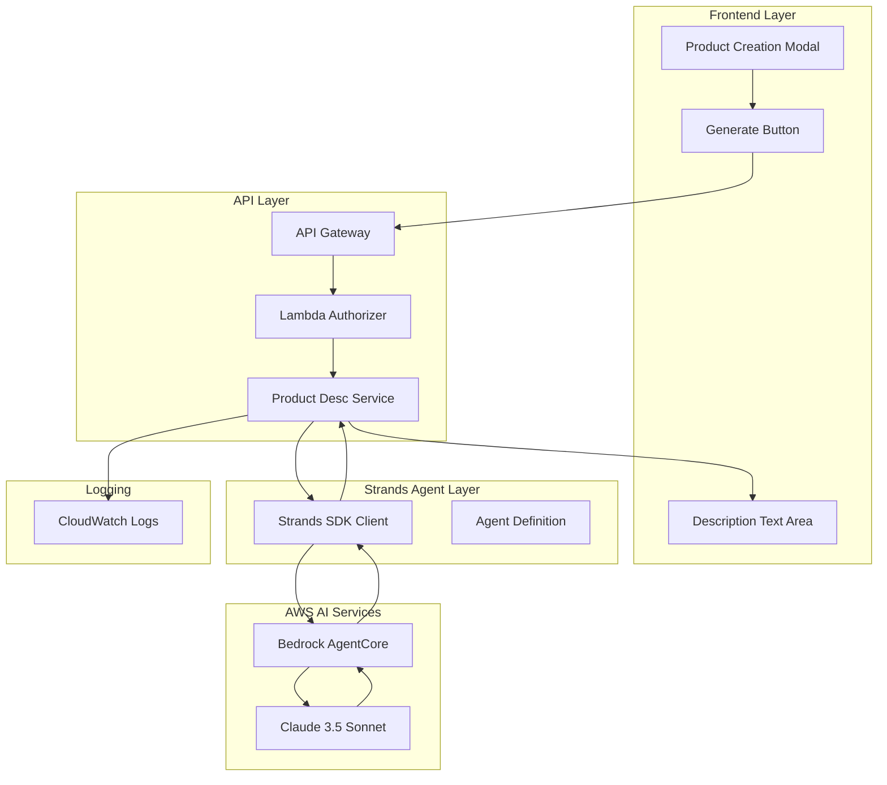
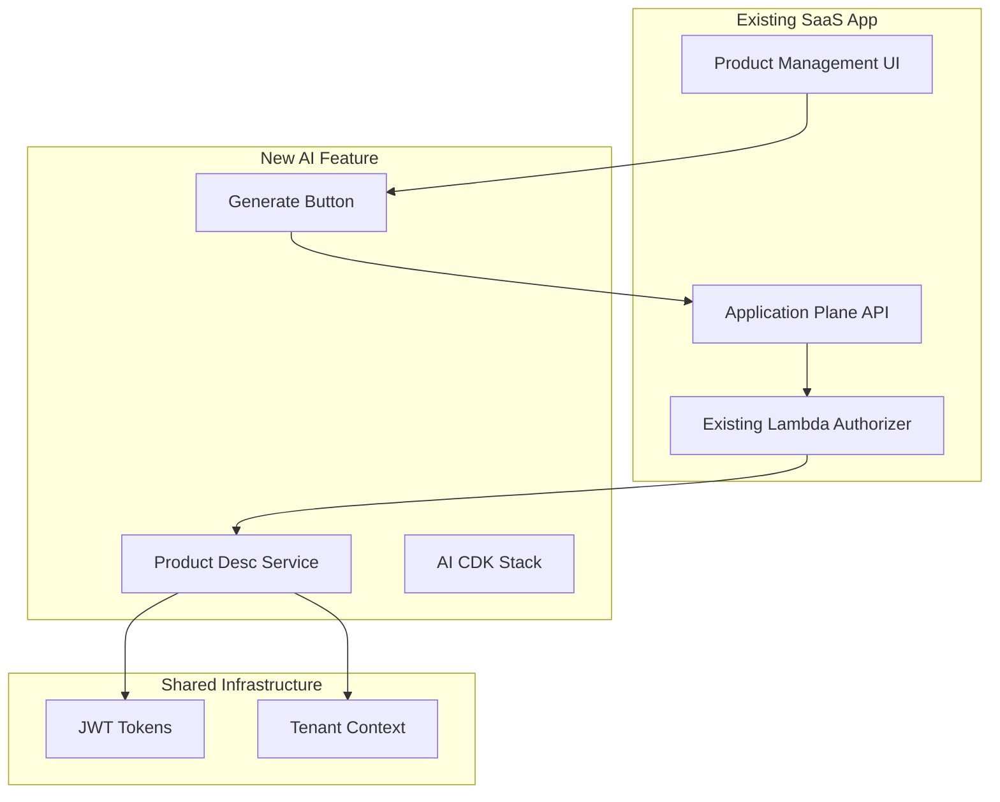

# Design Document

## Overview

The AI Product Description Generator integrates with the existing multi-tenant Agentic Insights SaaS platform using AWS Strands SDK and Bedrock AgentCore. The feature adds a "Generate" button to the product creation modal, enabling tenant admins to create professional product descriptions using Claude 3.5 Sonnet. The solution follows a modular architecture with a separate CDK stack, maintains existing authentication patterns, and includes comprehensive usage tracking for cost monitoring.

## Architecture

### High-Level Architecture



### Component Integration with Existing System



## Components and Interfaces

### 1. Strands Agent Development Structure

```
src/app-plane/strands-agents/product-description/
├── agent.yaml                    # Agent configuration
├── tools/
│   └── description_generator.py  # Core generation tool
├── prompts/
│   └── system_prompt.txt        # E-commerce expert instructions
├── requirements.txt             # Python dependencies
└── tests/
    └── test_agent.py           # Local testing
```

### 2. Agent Configuration (agent.yaml)

```yaml
name: product-description-generator
version: 1.0.0
foundation_model: anthropic.claude-3-5-sonnet-20241022-v2:0
description: "AI agent for generating e-commerce product descriptions"

tools:
  - name: generate_product_description
    description: "Generate compelling 3-4 sentence product descriptions"
    input_schema:
      type: object
      properties:
        product_name:
          type: string
          description: "Name of the product"
        short_description:
          type: string
          description: "Brief product description from user"
      required: ["product_name", "short_description"]

system_prompt: |
  You are an expert e-commerce product description writer. Generate compelling, 
  accurate product descriptions that help customers understand value and benefits.
  
  Instructions:
  1. Create exactly 3-4 sentences
  2. Focus on key features and benefits
  3. Use engaging, professional language
  4. Avoid technical jargon unless necessary
  5. Include emotional appeal where appropriate
  6. Ensure descriptions are suitable for online retail
```

### 3. Product Desc Service (Lambda Function)

#### Service Architecture
```python
class ProductDescService:
    def __init__(self):
        self.strands_client = StrandsBedrockClient()
        self.agent_id = os.environ['BEDROCK_AGENT_ID']
        self.agent_alias_id = os.environ['BEDROCK_AGENT_ALIAS_ID']
        self.input_token_price = float(os.environ.get('CLAUDE_INPUT_TOKEN_PRICE', '0.000003'))
        self.output_token_price = float(os.environ.get('CLAUDE_OUTPUT_TOKEN_PRICE', '0.000015'))
    
    def generate_description(self, product_name, short_description, tenant_id, tier_name):
        # Input validation
        # Strands agent invocation
        # Usage tracking and cost calculation
        # Error handling
        # Response formatting
```

#### Request/Response Flow
```json
// Request
POST /ai/generate-description
Headers:
  Authorization: Bearer <jwt_token>
  tenant_id: <tenant_id>
  tier_name: <basic|premium>

Body:
{
  "product_name": "Wireless Headphones",
  "short_description": "Bluetooth headphones with noise cancellation"
}

// Response
{
  "generated_description": "Experience premium audio quality with these advanced wireless headphones featuring cutting-edge noise cancellation technology. The seamless Bluetooth connectivity ensures crystal-clear sound for music, calls, and entertainment. Designed for comfort during extended use, these headphones deliver exceptional performance for both work and leisure. Perfect for audiophiles seeking professional-grade sound in a sleek, modern design.",
  "usage": {
    "input_tokens": 45,
    "output_tokens": 78,
    "total_tokens": 123,
    "input_cost": 0.000135,
    "output_cost": 0.00117,
    "total_cost": 0.001305
  },
  "status": "success"
}
```

### 4. Frontend Integration

#### Product Creation Modal Enhancement
```javascript
// Add Generate button next to description field
const generateButton = document.createElement('button');
generateButton.textContent = 'Generate';
generateButton.className = 'btn btn-secondary';
generateButton.onclick = handleGenerateDescription;

// Generate description handler
async function handleGenerateDescription() {
    const productName = document.getElementById('productName').value;
    const shortDesc = document.getElementById('shortDescription').value;
    
    if (!productName || !shortDesc) {
        showValidationError('Please enter product name and short description');
        return;
    }
    
    showLoadingSpinner();
    
    try {
        const response = await fetch('/ai/generate-description', {
            method: 'POST',
            headers: {
                'Authorization': `Bearer ${getJWTToken()}`,
                'tenant_id': getTenantId(),
                'tier_name': getTierName(),
                'Content-Type': 'application/json'
            },
            body: JSON.stringify({
                product_name: productName,
                short_description: shortDesc
            })
        });
        
        const result = await response.json();
        
        if (result.status === 'success') {
            document.getElementById('description').value = result.generated_description;
            showSuccessMessage('Description generated successfully!');
        } else {
            showErrorMessage(result.message || 'Failed to generate description');
        }
    } catch (error) {
        showErrorMessage('Network error. Please try again.');
    } finally {
        hideLoadingSpinner();
    }
}
```

## Data Models

### Usage Tracking Model
```python
{
    "timestamp": "2024-08-26T10:30:45.123Z",
    "tenant_id": "tenant-uuid-123",
    "tier_name": "premium",
    "request_id": "req-uuid-456",
    "model": "anthropic.claude-3-5-sonnet-20241022-v2:0",
    "input_tokens": 45,
    "output_tokens": 78,
    "total_tokens": 123,
    "input_cost": 0.000135,
    "output_cost": 0.00117,
    "total_cost": 0.001305,
    "duration_ms": 2340,
    "status": "success",
    "product_name_length": 18,
    "short_description_length": 42,
    "generated_description_length": 287
}
```

### Agent Input/Output Schema
```python
# Agent Tool Input
{
    "product_name": "string (max 100 chars)",
    "short_description": "string (max 500 chars)"
}

# Agent Tool Output
{
    "generated_description": "string (3-4 sentences)",
    "confidence_score": "float (0.0-1.0)",
    "word_count": "integer"
}
```

## Infrastructure Components

### CDK Stack Structure

#### AIDescriptionStack
```typescript
export class AIDescriptionStack extends Stack {
    constructor(scope: Construct, id: string, props: AIDescriptionStackProps) {
        super(scope, id, props);
        
        // Import existing resources
        const existingApiGateway = RestApi.fromRestApiId(this, 'ExistingApi', 
            Fn.importValue('AppPlaneApiGatewayId'));
        const existingAuthorizer = Authorizer.fromAuthorizerId(this, 'ExistingAuth',
            Fn.importValue('AppPlaneLambdaAuthorizerId'));
        
        // AI Description Lambda
        const aiLambda = new Function(this, 'AIDescriptionFunction', {
            runtime: Runtime.PYTHON_3_11,
            handler: 'product_desc_service.lambda_handler',
            code: Code.fromAsset('src/app-plane/product-desc'),
            environment: {
                BEDROCK_AGENT_ID: props.agentId,
                BEDROCK_AGENT_ALIAS_ID: props.agentAliasId,
                CLAUDE_INPUT_TOKEN_PRICE: '0.000003',
                CLAUDE_OUTPUT_TOKEN_PRICE: '0.000015'
            },
            timeout: Duration.seconds(30)
        });
        
        // Bedrock permissions
        aiLambda.addToRolePolicy(new PolicyStatement({
            effect: Effect.ALLOW,
            actions: [
                'bedrock:InvokeAgent',
                'bedrock:GetAgent',
                'bedrock:ListAgents'
            ],
            resources: [`arn:aws:bedrock:${this.region}:${this.account}:agent/*`]
        }));
        
        // API Gateway integration
        const aiResource = existingApiGateway.root.addResource('ai');
        aiResource.addMethod('POST', new LambdaIntegration(aiLambda), {
            authorizer: existingAuthorizer,
            requestValidator: new RequestValidator(this, 'AIRequestValidator', {
                restApi: existingApiGateway,
                validateRequestBody: true,
                validateRequestParameters: true
            })
        });
        
        // CloudWatch Log Group
        new LogGroup(this, 'AIDescriptionLogGroup', {
            logGroupName: `/aws/lambda/${aiLambda.functionName}`,
            retention: RetentionDays.ONE_MONTH
        });
    }
}
```

### Cross-Stack Integration
```typescript
// Export from existing app-plane-stack.ts
new CfnOutput(this, 'ApiGatewayId', {
    value: this.apiGateway.restApiId,
    exportName: 'AppPlaneApiGatewayId'
});

new CfnOutput(this, 'LambdaAuthorizerId', {
    value: this.lambdaAuthorizer.authorizerId,
    exportName: 'AppPlaneLambdaAuthorizerId'
});
```

## Deployment Strategy

### Strands Agent Deployment
```bash
# Local development and testing
cd src/app-plane/strands-agents/product-description/
strands init product-description-generator
strands test --local
strands validate

# Deploy to Bedrock AgentCore
strands deploy --target bedrock --alias prod
```

### CDK Infrastructure Deployment
```bash
# Deploy AI feature stack
cd infra/
cdk deploy AIDescriptionStack \
    --parameters agentId=<agent-id-from-strands> \
    --parameters agentAliasId=<alias-id-from-strands>
```

### Standalone Deployment Script
```bash
#!/bin/bash
# scripts/deploy-ai-desc-agent.sh

set -e

echo "🤖 Deploying AI Product Description Generator..."

# Step 1: Deploy Strands Agent
echo "📦 Deploying Strands Agent to Bedrock AgentCore..."
cd src/app-plane/strands-agents/product-description/
AGENT_OUTPUT=$(strands deploy --target bedrock --alias prod --output json)
AGENT_ID=$(echo $AGENT_OUTPUT | jq -r '.agent_id')
ALIAS_ID=$(echo $AGENT_OUTPUT | jq -r '.alias_id')

echo "✅ Agent deployed: $AGENT_ID (alias: $ALIAS_ID)"

# Step 2: Deploy CDK Stack
echo "🏗️ Deploying CDK Infrastructure..."
cd ../infra/
cdk deploy AIDescriptionStack \
    --parameters agentId=$AGENT_ID \
    --parameters agentAliasId=$ALIAS_ID \
    --require-approval never

echo "✅ AI Description Generator deployed successfully!"
echo "🔗 Agent ID: $AGENT_ID"
echo "🔗 API Endpoint: /ai/generate-description"
```

## Error Handling

### Lambda Error Handling
```python
def lambda_handler(event, context):
    try:
        # Validate input
        body = json.loads(event['body'])
        validate_input(body)
        
        # Extract tenant context
        tenant_id = event['headers']['tenant_id']
        tier_name = event['headers']['tier_name']
        
        # Generate description
        result = ai_service.generate_description(
            body['product_name'],
            body['short_description'],
            tenant_id,
            tier_name
        )
        
        return {
            'statusCode': 200,
            'body': json.dumps(result),
            'headers': {'Content-Type': 'application/json'}
        }
        
    except ValidationError as e:
        return error_response(400, f"Invalid input: {str(e)}")
    except BedrockError as e:
        return error_response(503, "AI service temporarily unavailable")
    except Exception as e:
        logger.error(f"Unexpected error: {str(e)}")
        return error_response(500, "Internal server error")

def error_response(status_code, message):
    return {
        'statusCode': status_code,
        'body': json.dumps({
            'status': 'error',
            'message': message
        }),
        'headers': {'Content-Type': 'application/json'}
    }
```

### Frontend Error Handling
```javascript
// User-friendly error messages
const ERROR_MESSAGES = {
    400: 'Please check your input and try again',
    401: 'Please log in again',
    403: 'You do not have permission to use this feature',
    503: 'AI service is temporarily unavailable. Please try again later',
    500: 'Something went wrong. Please try again'
};

function showErrorMessage(error) {
    const message = ERROR_MESSAGES[error.status] || error.message || 'An error occurred';
    // Display user-friendly error in UI
}
```

## Testing Strategy

### Strands Agent Testing
```python
# tests/test_agent.py
import pytest
from strands_sdk import StrandsTestClient

def test_description_generation():
    client = StrandsTestClient('product-description-generator')
    
    response = client.invoke_tool('generate_product_description', {
        'product_name': 'Wireless Headphones',
        'short_description': 'Bluetooth headphones with noise cancellation'
    })
    
    assert response.status == 'success'
    assert len(response.description.split('.')) >= 3  # 3-4 sentences
    assert 'headphones' in response.description.lower()
```

### Lambda Integration Testing
```python
def test_lambda_handler():
    event = {
        'body': json.dumps({
            'product_name': 'Test Product',
            'short_description': 'Test description'
        }),
        'headers': {
            'tenant_id': 'test-tenant',
            'tier_name': 'basic'
        }
    }
    
    response = lambda_handler(event, {})
    
    assert response['statusCode'] == 200
    body = json.loads(response['body'])
    assert 'generated_description' in body
    assert 'usage' in body
```

### End-to-End Testing
- Frontend button click triggers API call
- Authentication flow with JWT tokens
- AI generation and response handling
- Usage tracking and cost calculation
- Error scenarios and graceful degradation

## Monitoring and Observability

### Structured Logging
```python
import structlog

logger = structlog.get_logger()

def log_ai_usage(tenant_id, usage_data, request_data):
    logger.info(
        "ai_description_generated",
        tenant_id=tenant_id,
        input_tokens=usage_data['input_tokens'],
        output_tokens=usage_data['output_tokens'],
        total_cost=usage_data['total_cost'],
        product_name_length=len(request_data['product_name']),
        response_time_ms=usage_data['duration_ms'],
        model=usage_data['model']
    )
```