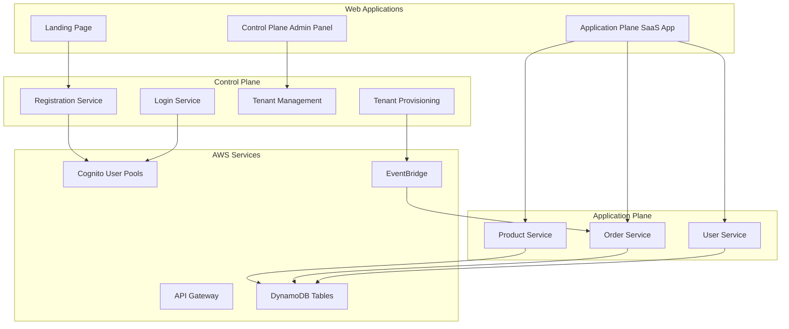

# Design Document

## Overview

The multi-tenant e-commerce SaaS platform follows a control plane and application plane architecture using AWS serverless technologies. The system supports tier-based deployment strategies with Basic and Premium tiers, each having different resource allocation patterns for cost optimization and tenant isolation.

## Architecture

### High-Level Architecture



### Tier-Based Resource Allocation

#### Basic Tier ($29)
- Shared Product Lambda + Shared DynamoDB table
- Shared Order Lambda + Shared DynamoDB table
- Shared Cognito User Pool (for all Basic tier tenants)
- API Routes: `/basic/product`, `/basic/order`, `/user`

#### Premium Tier ($99)
- Shared Product Lambda + Shared DynamoDB table
- Shared Order Lambda + Dedicated DynamoDB table per tenant
- Shared Cognito User Pool (for all Premium tier tenants)
- API Routes: `/premium/product`, `/premium/order`, `/user`

## Components and Interfaces

### Control Plane Services

#### Registration Service
- **Purpose**: Handle tenant self-registration from landing page
- **Input**: Tenant details, tier selection
- **Output**: Tenant ID, Cognito user creation
- **Technology**: Python Lambda, DynamoDB

#### Login Service
- **Purpose**: Authenticate users and return JWT tokens
- **Input**: User credentials
- **Output**: JWT token with tenant_id custom attribute
- **Technology**: Python Lambda, Cognito integration

#### Tenant Management Service
- **Purpose**: CRUD operations for tenant lifecycle
- **Input**: Admin requests for tenant operations
- **Output**: Tenant status updates
- **Technology**: Python Lambda, DynamoDB

#### Tenant Provisioning Service
- **Purpose**: Provision tier-specific resources
- **Input**: EventBridge events for new tenants
- **Output**: Resource creation (DynamoDB tables for Premium)
- **Technology**: Python Lambda, CDK for dynamic resource creation

### Application Plane Services

#### Product Service
- **Purpose**: Manage product catalog per tenant
- **Input**: Product CRUD operations with tenant_id
- **Output**: Tenant-filtered product data
- **Technology**: Python Lambda, DynamoDB with tenant_id partition

#### Order Service
- **Purpose**: Handle order creation and retrieval
- **Input**: Order operations with tenant_id and tier
- **Output**: Orders stored in appropriate database
- **Technology**: Python Lambda, tier-specific DynamoDB routing

#### User Service
- **Purpose**: Manage tenant users (common for both tiers)
- **Input**: User management operations
- **Output**: Cognito user operations
- **Technology**: Python Lambda, Cognito User Pool management

### Web Applications

#### Landing Page
- **Technology**: Vanilla HTML/CSS/JS
- **Features**: Tier selection, registration form
- **Hosting**: S3 + CloudFront

#### Control Plane Admin Panel
- **Technology**: Vanilla HTML/CSS/JS
- **Features**: Tenant provisioning, deprovisioning, dashboard
- **Authentication**: Admin Cognito User Pool
- **Hosting**: S3 + CloudFront

#### Application Plane SaaS App
- **Technology**: Vanilla HTML/CSS/JS
- **Features**: Product management, order creation, user management
- **Authentication**: Tenant Cognito User Pools
- **Hosting**: S3 + CloudFront

## Data Models

### Tenant Model
```python
{
    "tenant_id": "string (UUID)",
    "tenant_name": "string",
    "tier": "basic|premium",
    "status": "active|inactive|provisioning",
    "created_at": "timestamp",
    "admin_email": "string",
    "order_table_name": "string (for premium only)"
}
```

### Product Model
```python
{
    "tenant_id": "string (partition key)",
    "product_id": "string (sort key)",
    "name": "string",
    "description": "string",
    "price": "decimal",
    "created_at": "timestamp",
    "created_by": "string (user_id)"
}
```

### Order Model
```python
{
    "tenant_id": "string (partition key)",
    "order_id": "string (sort key)",
    "items": [
        {
            "product_id": "string",
            "product_name": "string",
            "price": "decimal",
            "quantity": "number"
        }
    ],
    "total_amount": "decimal",
    "status": "pending|completed|failed",
    "created_at": "timestamp",
    "created_by": "string (user_id)"
}
```

### User Model (Cognito Attributes)
```python
{
    "email": "string",
    "tenant_id": "string (custom attribute)",
    "role": "tenant_admin|tenant_user",
    "status": "active|inactive"
}
```

## API Design

### Control Plane APIs
- `POST /register` - Tenant registration
- `POST /login` - User authentication
- `GET /tenants` - List tenants (admin only)
- `POST /tenants` - Create tenant (admin only)
- `DELETE /tenants/{tenant_id}` - Delete tenant (admin only)

### Application Plane APIs

#### Basic Tier
- `GET /basic/products` - List products
- `POST /basic/products` - Create product
- `GET /basic/products/{product_id}` - Get product details
- `PUT /basic/products/{product_id}` - Update product
- `DELETE /basic/products/{product_id}` - Delete product
- `GET /basic/orders` - List orders
- `POST /basic/orders` - Create order

#### Premium Tier
- `GET /premium/products` - List products
- `POST /premium/products` - Create product
- `GET /premium/products/{product_id}` - Get product details
- `PUT /premium/products/{product_id}` - Update product
- `DELETE /premium/products/{product_id}` - Delete product
- `GET /premium/orders` - List orders
- `POST /premium/orders` - Create order

#### Common APIs
- `GET /user` - List tenant users
- `POST /user` - Create tenant user
- `PUT /user/{user_id}` - Update tenant user
- `DELETE /user/{user_id}` - Delete tenant user

## Infrastructure Components

### CDK Stacks

#### Control Plane Stack
- API Gateway for control plane endpoints
- Lambda functions for control plane services
- DynamoDB table for tenant management
- EventBridge custom bus
- Cognito User Pool for admins

#### Application Plane Stack
- API Gateway for application plane endpoints
- Lambda functions for application plane services
- DynamoDB tables (shared for basic, dynamic for premium)
- Shared Cognito User Pool for Basic tier tenants
- Shared Cognito User Pool for Premium tier tenants
- S3 buckets for web hosting
- CloudFront distributions

### Dynamic Resource Creation
- Premium tenant provisioning triggers CDK deployment
- Creates dedicated DynamoDB table per premium tenant
- Updates Lambda environment variables for table routing

## Security and Authentication

### JWT Token Flow
1. User authenticates via Cognito
2. Cognito returns JWT with tenant_id custom attribute
3. Frontend includes JWT and tenant_id in headers
4. Lambda authorizer validates JWT and extracts tenant_id
5. Backend services use tenant_id for data isolation

### Lambda Authorizer
- Validates JWT signature
- Extracts tenant_id from custom attributes
- Passes tenant context to backend services
- Handles both basic and premium tier routing

## Error Handling

### API Error Responses
- 400: Bad Request (validation errors)
- 401: Unauthorized (invalid JWT)
- 403: Forbidden (insufficient permissions)
- 404: Not Found (resource not found)
- 500: Internal Server Error (system errors)

## Testing Strategy

### Unit Testing
- Python Lambda functions with pytest

### Integration Testing
- API Gateway endpoint testing

### End-to-End Testing
- Web application user flows
- Multi-tenant data isolation
- Tier-specific resource allocation

## Deployment Strategy

### Infrastructure Deployment
- CDK deployment for baseline infrastructure
- Separate stacks for control plane and application plane

### Application Deployment
- Lambda function deployment via CDK
- Web application deployment to S3
- CloudFront cache invalidation

### Monitoring and Logging
- CloudWatch logs for all Lambda functions
- X-Ray tracing for request flow