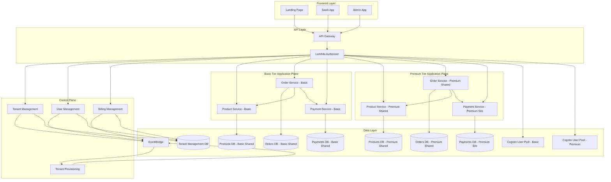

# Design Document

## Overview

The multi-tenant Agentic Insights SaaS e-commerce platform follows a serverless architecture on AWS with clear separation between control plane and application plane operations. The system implements tier-based resource allocation where Basic tier tenants share all resources for cost efficiency, while Premium tier tenants get dedicated silo resources for better isolation. The system uses event-driven communication between planes while maintaining sequential execution within the application plane for simplicity. The design emphasizes tenant isolation, scalability, cost optimization, and workshop-friendly deployment.

## Architecture

### High-Level Architecture



### Control Plane vs Application Plane

**Control Plane:**
- Manages tenant lifecycle (provisioning, deprovisioning, billing)
- Handles user management within tenants
- Communicates via EventBridge for loose coupling
- Operates on shared resources with tenant filtering
- Routes tenants to appropriate tier-based resources

**Basic Tier Application Plane:**
- Provides cost-effective shared e-commerce functionality
- All tenants share Product, Order, and Payment services
- Uses shared databases with tenant_id filtering
- Optimized for cost efficiency and resource sharing

**Premium Tier Application Plane:**
- Provides enhanced e-commerce functionality with selective isolation
- Shared Product Service with dedicated Premium database
- Shared Order Service with dedicated Premium database
- Silo Payment service per tenant with dedicated databases
- Uses shared databases for products and orders, silo databases for payments
- Optimized for performance with payment-level tenant isolation

## Components and Interfaces

### Authentication and Authorization

**Cognito User Pool Configuration:**
- **Basic Tier User Pool:** Shared across all Basic tier tenants
- **Premium Tier User Pool:** Shared across all Premium tier tenants
- Custom attributes: `tenant_id` (string), `tier` (string)
- User groups per tenant within each tier-specific User Pool
- JWT tokens include tenant_id and tier as custom claims

**Lambda Authorizer:**
```python
def lambda_handler(event, context):
    token = extract_token(event['authorizationToken'])
    claims = validate_jwt(token)
    tenant_id = claims.get('custom:tenant_id')
    tier = claims.get('custom:tier')
    
    # Route to appropriate service endpoints based on tier
    service_endpoints = get_service_endpoints(tenant_id, tier)
    
    return {
        'principalId': claims['sub'],
        'policyDocument': generate_policy('Allow', event['methodArn']),
        'context': {
            'tenant_id': tenant_id,
            'tier': tier,
            'service_endpoints': service_endpoints,
            'user_role': claims.get('cognito:groups', ['user'])[0]
        }
    }
```

### API Gateway Structure

**Control Plane APIs:**
- `/control/tenants` - Tenant provisioning and management
- `/control/tenants/{tenant_id}/deprovision` - Tenant deprovisioning (admin only)
- `/control/users` - User management  
- `/control/billing` - Billing operations
- `/control/admin` - System admin functions

**Basic Tier Application Plane APIs:**
- `/app/basic/products` - Shared product catalog
- `/app/basic/orders` - Shared order management
- `/app/basic/payments` - Shared payment processing
- `/app/basic/cart` - Shared shopping cart operations

**Premium Tier Application Plane APIs:**
- `/app/premium/products` - Premium shared product catalog
- `/app/premium/orders` - Premium shared order management
- `/app/premium/{tenant_id}/payments` - Silo payment processing
- `/app/premium/cart` - Premium shared shopping cart operations

### Microservices Design

**Tenant Management Service:**
```python
class TenantService:
    def create_tenant(self, tenant_data):
        # Validate tier (Basic/Premium)
        # Create tenant record
        # Publish tenant.created event
        # Return tenant_id
        
    def provision_tenant(self, tenant_id, tier):
        if tier == "Basic":
            # Create user group in Basic Cognito User Pool
            # No additional infrastructure needed
            # Uses shared Basic tier resources
        elif tier == "Premium":
            # Create user group in Premium Cognito User Pool
            # Create silo Payment Lambda function
            # Initialize silo database for payments
            # Uses shared Premium Product and Order Services
        # Set up tier-specific monitoring
        
    def deprovision_tenant(self, tenant_id, tier, admin_context):
        # Validate admin permissions
        if tier == "Basic":
            # Remove user group from Basic Cognito User Pool
            # No infrastructure cleanup needed
        elif tier == "Premium":
            # Remove user group from Premium Cognito User Pool
            # Delete silo Payment Lambda function
            # Delete silo Payment database
            # Clean up S3 objects
        # Remove tenant record
        # Publish tenant.deprovisioned event
```

**Product Service:**
```python
class ProductService:
    def create_product(self, tenant_id, product_data):
        # Validate tenant context
        # Store in shared DB with tenant_id
        # Handle image uploads to S3
        
    def get_products(self, tenant_id):
        # Filter by tenant_id
        # Return tenant-specific catalog
```

**Order Service:**
```python
class OrderService:
    def create_order(self, tenant_id, user_id, cart_items):
        # Store in tenant-specific silo DB
        # Calculate totals
        # Initiate payment processing
        # Return order_id
```

## Data Models

### Basic Tier Shared Databases

**Table: Products_Basic**
```json
{
    "PK": "TENANT#tenant_id",
    "SK": "PRODUCT#product_id", 
    "tenant_id": "string",
    "product_id": "string",
    "name": "string",
    "description": "string",
    "price": "number",
    "images": ["string"],
    "created_at": "timestamp",
    "updated_at": "timestamp"
}
```

**Table: Orders_Basic**
```json
{
    "PK": "TENANT#tenant_id",
    "SK": "ORDER#order_id",
    "tenant_id": "string",
    "order_id": "string",
    "user_id": "string", 
    "items": [
        {
            "product_id": "string",
            "quantity": "number",
            "price": "number"
        }
    ],
    "total_amount": "number",
    "status": "string",
    "created_at": "timestamp"
}
```

**Table: Payments_Basic**
```json
{
    "PK": "TENANT#tenant_id",
    "SK": "PAYMENT#payment_id",
    "tenant_id": "string",
    "payment_id": "string",
    "order_id": "string",
    "amount": "number",
    "status": "string",
    "gateway_response": "object",
    "processed_at": "timestamp"
}
```

### Premium Tier Databases

**Table: Products_Premium (Shared)**
```json
{
    "PK": "TENANT#tenant_id",
    "SK": "PRODUCT#product_id", 
    "tenant_id": "string",
    "product_id": "string",
    "name": "string",
    "description": "string",
    "price": "number",
    "images": ["string"],
    "created_at": "timestamp",
    "updated_at": "timestamp"
}
```

**Table: Orders_Premium (Shared)**
```json
{
    "PK": "TENANT#tenant_id",
    "SK": "ORDER#order_id",
    "tenant_id": "string",
    "order_id": "string",
    "user_id": "string", 
    "items": [
        {
            "product_id": "string",
            "quantity": "number",
            "price": "number"
        }
    ],
    "total_amount": "number",
    "status": "string",
    "created_at": "timestamp"
}
```

**Table: Payments_{tenant_id} (Silo per Premium tenant)**
```json
{
    "PK": "PAYMENT#payment_id",
    "SK": "ORDER#order_id",
    "payment_id": "string",
    "order_id": "string",
    "amount": "number",
    "status": "string",
    "gateway_response": "object",
    "processed_at": "timestamp"
}
```

### Control Plane Database (DynamoDB)

**Table: Tenants**
```json
{
    "PK": "TENANT#tenant_id",
    "SK": "TENANT#tenant_id",
    "tenant_id": "string",
    "name": "string",
    "tier": "Basic|Premium",
    "status": "active|suspended",
    "cognito_user_pool": "basic-pool-id|premium-pool-id",
    "service_endpoints": {
        "product": "basic-shared|premium-shared",
        "order": "basic-shared|premium-shared",
        "payment": "basic-shared|premium-silo-tenant_id"
    },
    "created_at": "timestamp",
    "billing_info": "object"
}
```

## Error Handling

### API Error Responses

**Standard Error Format:**
```json
{
    "error": {
        "code": "TENANT_NOT_FOUND",
        "message": "The specified tenant does not exist",
        "details": {
            "tenant_id": "invalid_id"
        }
    }
}
```

**Error Categories:**
- Authentication errors (401)
- Authorization errors (403) 
- Validation errors (400)
- Resource not found (404)
- Internal server errors (500)

### Tenant Isolation Failures

**Security Measures:**
- Log all cross-tenant access attempts
- Alert system administrators immediately
- Block suspicious requests automatically
- Audit trail for compliance

### Payment Processing Errors

**Mock Payment Gateway:**
```python
class MockPaymentGateway:
    def process_payment(self, amount, card_info):
        # Simulate random failures (10% rate)
        # Return success/failure with transaction_id
        # Log all transactions for workshop demo
```

## Testing Strategy

### Unit Testing

**Test Coverage Requirements:**
- All Lambda functions: 90%+ coverage
- Business logic validation
- Error handling scenarios
- Tenant isolation enforcement

**Example Test Structure:**
```python
class TestProductService:
    def test_create_product_with_valid_tenant(self):
        # Test successful product creation
        
    def test_create_product_with_invalid_tenant(self):
        # Test tenant validation failure
        
    def test_get_products_filters_by_tenant(self):
        # Test tenant isolation
```

### Integration Testing

**API Testing:**
- End-to-end user flows
- Cross-service communication
- EventBridge message handling
- Database operations

**Workshop Validation:**
- Seeding script functionality
- Demo tenant creation
- Sample data loading
- Frontend integration

### Load Testing

**Tenant Isolation Under Load:**
- Concurrent multi-tenant operations
- Database performance with tenant filtering
- API Gateway throttling behavior
- Lambda cold start impact

## Infrastructure Components

### CDK Stack Organization

**Shared Stack:**
- EventBridge custom bus
- API Gateway with custom domain
- CloudWatch log groups and dashboards
- S3 buckets for static assets

**Control Plane Stack:**
- Basic Tier Cognito User Pool with custom attributes
- Premium Tier Cognito User Pool with custom attributes
- Lambda functions for control plane services
- DynamoDB table for tenant management
- IAM roles and policies

**Basic Tier Application Plane Stack:**
- Shared Lambda functions for Basic tier services
- Shared DynamoDB tables (products, orders, payments)
- S3 bucket for Basic tier product images
- CloudFront distribution

**Premium Tier Application Plane Stack:**
- Shared Lambda functions for Premium Product and Order Services
- Shared DynamoDB tables for Premium products and orders
- Template resources for silo Payment Lambda functions
- Template resources for silo Payment DynamoDB tables
- S3 bucket for Premium tier product images
- CloudFront distribution

**Frontend Stack:**
- S3 buckets for each web app
- CloudFront distributions
- Route 53 DNS records (if custom domain)

### Monitoring and Observability

**CloudWatch Configuration:**
- Lambda function logs and metrics
- API Gateway access logs
- DynamoDB operation metrics
- Custom business metrics (orders, revenue)

**Alarms and Notifications:**
- High error rates
- Tenant isolation violations
- Payment processing failures
- Resource utilization thresholds

### Security Considerations

**IAM Policies:**
- Least privilege access
- Service-specific roles
- Cross-account access prevention
- Resource-based policies for DynamoDB

**Data Encryption:**
- DynamoDB encryption at rest
- S3 bucket encryption
- API Gateway TLS termination
- Cognito token encryption

## Workshop-Specific Design

### Seeding Strategy

**Demo Tenant Setup:**
```bash
#!/bin/bash
# Create demo tenant
TENANT_ID=$(curl -X POST /control/tenants -d '{"name":"Demo Store","tier":"Premium"}')

# Seed products via API
for product in products.json; do
    curl -X POST /app/products -H "X-Tenant-ID: $TENANT_ID" -d "$product"
done
```

**Sample Data Structure:**
- 20+ diverse products across categories
- Realistic pricing for both tiers
- High-quality product images
- Varied descriptions and metadata

### Deployment Automation

**Single Command Deployment:**
```bash
npm run deploy:all
# Deploys infrastructure, builds frontends, runs seeding
```

**Environment Configuration:**
- Development, staging, production environments
- Parameter store for configuration
- Automated testing in CI/CD pipeline

This design provides a robust, scalable, and workshop-friendly multi-tenant Agentic Insights SaaS e-commerce platform that demonstrates real-world AWS serverless patterns while maintaining appropriate complexity for learning purposes.