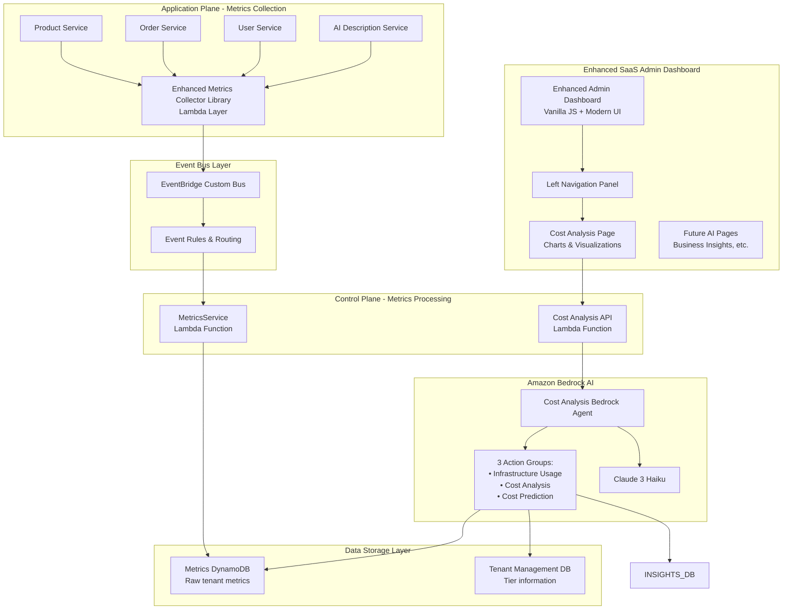

# Design Document

## Overview

The Metering Framework with AI-Powered Cost Analysis integrates comprehensive tenant-specific metrics collection, real-time cost calculation, and AI-driven insights into the existing multi-tenant Agentic Insights SaaS platform. The system uses an event-driven architecture with Amazon Bedrock Agent powered by Claude 3 Haiku to provide actionable cost intelligence through an enhanced admin dashboard with modern visualizations.

## Architecture

### High-Level Architecture



### Layered Architecture Overview

The system follows a layered architecture with clear separation of concerns:

1. **Metrics Collection Layer**: Enhanced Lambda Layer library for comprehensive usage tracking
2. **Event Pipeline Layer**: EventBridge-based reliable metrics transmission
3. **AI Analysis Layer**: Bedrock Agent with Claude 3 Haiku for cost intelligence
4. **Data Storage Layer**: DynamoDB for metrics with proper indexing
5. **Presentation Layer**: Enhanced admin dashboard with modern UI and visualizations

### Component Integration Flow

```
Application Services → Metrics Library → EventBridge → MetricsService → DynamoDB
                                                                           ↓
Admin Dashboard → Cost API → Bedrock Agent → Action Groups → AI Analysis
```

### Data Flow Architecture

```mermaid
sequenceDiagram
    participant APP as Application Service
    participant METRICS as Metrics Collector
    participant EB as EventBridge
    participant MS as MetricsService
    participant DB as Metrics DB
    participant DASH as Dashboard
    participant API as Cost API
    participant AGENT as Bedrock Agent

    APP->>METRICS: Execute operation
    METRICS->>METRICS: Calculate costs
    METRICS->>EB: Publish metric event
    EB->>MS: Route event
    MS->>DB: Store metrics
    
    DASH->>API: Request cost analysis
    API->>AGENT: Invoke with prompt
    AGENT->>DB: Query metrics data
    DB-->>AGENT: Return usage data
    AGENT-->>API: AI analysis response
    
    API-->>DASH: Cost analysis data
    DASH->>DASH: Render charts & insights
```#
# Components and Interfaces

### 1. Enhanced Metrics Collector Library (Lambda Layer)

**Location**: `src/layers/metrics-collector/`
**Purpose**: Comprehensive tenant-specific metrics collection with real-time cost calculation
**Technology**: Python Lambda Layer

#### Implementation

```python
# src/layers/metrics-collector/python/metrics_collector/collector.py
import boto3
import json
import time
import os
from typing import Dict, Any, Optional
from datetime import datetime

class MetricsCollector:
    def __init__(self, service_name: str, tenant_id: str, tier_name: str):
        self.service_name = service_name
        self.tenant_id = tenant_id
        self.tier_name = tier_name
        self.eventbridge = boto3.client('events')
        self.event_bus_name = os.environ.get('METRICS_EVENT_BUS_NAME')
        
        # AWS pricing constants (Claude 3 Haiku pricing)
        self.pricing = {
            'api_gateway_requests': 3.50e-6,  # $3.50 per million requests
            'lambda_gb_second': 0.0000166667,  # $0.0000166667 per GB-second
            'lambda_request': 2.0e-7,  # $0.20 per million requests
            'dynamodb_wcu': 1.25e-6,  # $1.25 per million WCUs
            'dynamodb_rcu': 0.25e-6,  # $0.25 per million RCUs
            'claude_haiku_input_token': 0.25e-6,  # $0.25 per million input tokens
            'claude_haiku_output_token': 1.25e-6,  # $1.25 per million output tokens
            's3_requests': 0.4e-3,  # $0.40 per 1000 requests
            's3_storage_gb_month': 0.023  # $0.023 per GB per month
        }
    
    def track_api_request(self, endpoint: str, method: str, status_code: int,
                         response_time_ms: float, request_size: int = 0,
                         response_size: int = 0, user_id: Optional[str] = None):
        """Track API Gateway request with cost calculation"""
        
        cost = self.pricing['api_gateway_requests']
        
        self._publish_event("api.request", {
            "endpoint": endpoint,
            "method": method,
            "status_code": status_code,
            "request_size_bytes": request_size,
            "response_size_bytes": response_size,
            "estimated_cost": cost
        }, user_id, {
            "response_time_ms": response_time_ms
        })
    
    def track_lambda_execution(self, function_name: str, memory_mb: int,
                              duration_ms: float, memory_used_mb: int = None,
                              cold_start: bool = False):
        """Track Lambda execution with cost calculation"""
        
        # Calculate Lambda costs
        memory_gb = memory_mb / 1024
        duration_seconds = duration_ms / 1000
        
        compute_cost = self.pricing['lambda_gb_second'] * memory_gb * duration_seconds
        request_cost = self.pricing['lambda_request']
        total_cost = compute_cost + request_cost
        
        self._publish_event("lambda.execution", {
            "function_name": function_name,
            "memory_allocated_mb": memory_mb,
            "execution_duration_ms": duration_ms,
            "billed_duration_ms": max(duration_ms, 100),  # Minimum 100ms billing
            "memory_used_mb": memory_used_mb or memory_mb,
            "cold_start": cold_start,
            "estimated_cost": total_cost,
            "cost_breakdown": {
                "compute_cost": compute_cost,
                "request_cost": request_cost
            }
        })
    
    def track_dynamodb_operation(self, table_name: str, operation: str,
                                consumed_rcu: float = 0, consumed_wcu: float = 0,
                                item_size_bytes: int = 0, is_dedicated: bool = False):
        """Track DynamoDB operation with cost calculation"""
        
        read_cost = consumed_rcu * self.pricing['dynamodb_rcu']
        write_cost = consumed_wcu * self.pricing['dynamodb_wcu']
        total_cost = read_cost + write_cost
        
        self._publish_event("dynamodb.operation", {
            "table_name": table_name,
            "operation": operation,
            "consumed_read_capacity": consumed_rcu,
            "consumed_write_capacity": consumed_wcu,
            "item_size_bytes": item_size_bytes,
            "is_dedicated_table": is_dedicated,
            "estimated_cost": total_cost,
            "cost_breakdown": {
                "read_cost": read_cost,
                "write_cost": write_cost
            }
        })
    
    def track_bedrock_invocation(self, model_id: str, input_tokens: int,
                                output_tokens: int, request_type: str = "general",
                                user_id: Optional[str] = None):
        """Track Bedrock AI usage with Claude 3 Haiku cost calculation"""
        
        input_cost = input_tokens * self.pricing['claude_haiku_input_token']
        output_cost = output_tokens * self.pricing['claude_haiku_output_token']
        total_cost = input_cost + output_cost
        
        self._publish_event("bedrock.invocation", {
            "model_id": model_id,
            "input_tokens": input_tokens,
            "output_tokens": output_tokens,
            "total_tokens": input_tokens + output_tokens,
            "request_type": request_type
        }, user_id, costs={
            "input_cost": input_cost,
            "output_cost": output_cost,
            "total_cost": total_cost
        })
    
    def track_s3_operation(self, bucket_name: str, operation: str,
                          object_size_bytes: int = 0, storage_class: str = "STANDARD"):
        """Track S3 operation with cost calculation"""
        
        request_cost = self.pricing['s3_requests'] / 1000  # Per request
        
        # Storage cost (monthly, so divide by days in month and hours)
        storage_gb = object_size_bytes / (1024**3)
        hourly_storage_cost = (storage_gb * self.pricing['s3_storage_gb_month']) / (30 * 24)
        
        self._publish_event("s3.operation", {
            "bucket_name": bucket_name,
            "operation": operation,
            "object_size_bytes": object_size_bytes,
            "storage_class": storage_class,
            "estimated_cost": request_cost,
            "hourly_storage_cost": hourly_storage_cost
        })
    
    def _publish_event(self, event_type: str, metadata: Dict[str, Any],
                      user_id: Optional[str] = None, performance: Optional[Dict] = None,
                      costs: Optional[Dict] = None):
        """Internal method to publish events to EventBridge"""
        
        try:
            event_detail = {
                "tenant_id": self.tenant_id,
                "tier_name": self.tier_name,
                "service_name": self.service_name,
                "event_type": event_type,
                "timestamp": datetime.now().isoformat(),
                "user_id": user_id,
                "metadata": metadata,
                "performance": performance or {},
                "costs": costs or {}
            }
            
            self.eventbridge.put_events(
                Entries=[{
                    'Source': 'agentic-insights.metrics',
                    'DetailType': 'Tenant Metric Event',
                    'Detail': json.dumps(event_detail),
                    'EventBusName': self.event_bus_name
                }]
            )
        except Exception as e:
            # Log error but don't fail the main operation
            print(f"Metrics collection failed: {str(e)}")
```##
# 2. Application Service Integration

#### Enhanced Product Service Integration

```python
# src/app-plane/product/product_service.py
from metrics_collector import MetricsCollector
import time
import boto3
import json

def lambda_handler(event, context):
    start_time = time.time()
    
    # Extract tenant context
    tenant_id = event['headers']['tenant_id']
    tier_name = event['headers']['tier_name']
    user_id = event['requestContext']['authorizer']['user_id']
    
    # Initialize metrics collector
    metrics = MetricsCollector("product-service", tenant_id, tier_name)
    
    # Track Lambda execution start
    function_name = context.function_name
    memory_mb = int(context.memory_limit_in_mb)
    
    try:
        # Business logic
        if event['httpMethod'] == 'POST':
            product_data = json.loads(event['body'])
            
            # Track DynamoDB write
            dynamodb = boto3.resource('dynamodb')
            table_name = get_products_table_name(tier_name)
            table = dynamodb.Table(table_name)
            
            # Put item and track metrics
            response = table.put_item(Item=product_data)
            
            # Track DynamoDB operation
            metrics.track_dynamodb_operation(
                table_name=table_name,
                operation="PutItem",
                consumed_wcu=1.0,  # Estimate based on item size
                item_size_bytes=len(json.dumps(product_data)),
                is_dedicated=(tier_name == "premium")
            )
            
            result = {'statusCode': 200, 'body': json.dumps(product_data)}
        
        elif event['httpMethod'] == 'GET':
            # Track DynamoDB read operations
            dynamodb = boto3.resource('dynamodb')
            table_name = get_products_table_name(tier_name)
            table = dynamodb.Table(table_name)
            
            if 'pathParameters' in event and event['pathParameters']:
                # Single product retrieval
                product_id = event['pathParameters']['product_id']
                response = table.get_item(Key={'tenant_id': tenant_id, 'product_id': product_id})
                
                metrics.track_dynamodb_operation(
                    table_name=table_name,
                    operation="GetItem",
                    consumed_rcu=0.5,
                    is_dedicated=(tier_name == "premium")
                )
                
                result = {'statusCode': 200, 'body': json.dumps(response.get('Item', {}))}
            else:
                # List products
                response = table.query(
                    KeyConditionExpression=Key('tenant_id').eq(tenant_id)
                )
                
                metrics.track_dynamodb_operation(
                    table_name=table_name,
                    operation="Query",
                    consumed_rcu=len(response['Items']) * 0.5,
                    is_dedicated=(tier_name == "premium")
                )
                
                result = {'statusCode': 200, 'body': json.dumps(response['Items'])}
        
        # Calculate execution metrics
        execution_time = (time.time() - start_time) * 1000
        
        # Track Lambda execution
        metrics.track_lambda_execution(
            function_name=function_name,
            memory_mb=memory_mb,
            duration_ms=execution_time,
            memory_used_mb=get_memory_usage(),  # Would need actual memory tracking
            cold_start=is_cold_start(context)
        )
        
        # Track API request
        metrics.track_api_request(
            endpoint=event['resource'],
            method=event['httpMethod'],
            status_code=200,
            response_time_ms=execution_time,
            request_size=len(event.get('body', '')),
            response_size=len(result['body']),
            user_id=user_id
        )
        
        return result
        
    except Exception as e:
        execution_time = (time.time() - start_time) * 1000
        
        # Track failed execution
        metrics.track_lambda_execution(
            function_name=function_name,
            memory_mb=memory_mb,
            duration_ms=execution_time
        )
        
        metrics.track_api_request(
            endpoint=event['resource'],
            method=event['httpMethod'],
            status_code=500,
            response_time_ms=execution_time,
            user_id=user_id
        )
        
        raise

def get_products_table_name(tier_name):
    """Get appropriate table name based on tier"""
    if tier_name == "premium":
        return os.environ['PREMIUM_PRODUCTS_TABLE']
    else:
        return os.environ['BASIC_PRODUCTS_TABLE']

def get_memory_usage():
    """Get actual memory usage (implementation needed)"""
    return 128  # Placeholder

def is_cold_start(context):
    """Detect if this is a cold start"""
    # Implementation would check if this is first invocation
    return False  # Placeholder
```

#### AI Description Service Integration

```python
# src/app-plane/ai-description/ai_description_service.py
from metrics_collector import MetricsCollector
import boto3
import json
import time

def lambda_handler(event, context):
    start_time = time.time()
    
    tenant_id = event['headers']['tenant_id']
    tier_name = event['headers']['tier_name']
    user_id = event['requestContext']['authorizer']['user_id']
    
    metrics = MetricsCollector("ai-description-service", tenant_id, tier_name)
    
    try:
        # Parse request
        body = json.loads(event['body'])
        product_name = body['product_name']
        short_description = body['short_description']
        
        # Create prompt
        prompt = f"Generate a compelling 3-4 sentence product description for: {product_name}. Brief description: {short_description}"
        
        # Invoke Bedrock
        bedrock = boto3.client('bedrock-runtime')
        
        response = bedrock.invoke_model(
            modelId='anthropic.claude-3-haiku-20240307-v1:0',
            body=json.dumps({
                'anthropic_version': 'bedrock-2023-05-31',
                'max_tokens': 200,
                'messages': [{'role': 'user', 'content': prompt}]
            })
        )
        
        result = json.loads(response['body'].read())
        
        # Extract token usage
        usage = result.get('usage', {})
        input_tokens = usage.get('input_tokens', 0)
        output_tokens = usage.get('output_tokens', 0)
        
        # Track Bedrock usage
        metrics.track_bedrock_invocation(
            model_id='anthropic.claude-3-haiku-20240307-v1:0',
            input_tokens=input_tokens,
            output_tokens=output_tokens,
            request_type='description_generation',
            user_id=user_id
        )
        
        # Track other metrics (Lambda, API, etc.)
        execution_time = (time.time() - start_time) * 1000
        
        metrics.track_lambda_execution(
            function_name=context.function_name,
            memory_mb=int(context.memory_limit_in_mb),
            duration_ms=execution_time
        )
        
        metrics.track_api_request(
            endpoint='/ai/generate-description',
            method='POST',
            status_code=200,
            response_time_ms=execution_time,
            user_id=user_id
        )
        
        return {
            'statusCode': 200,
            'body': json.dumps({
                'generated_description': result['content'][0]['text'],
                'usage': {
                    'input_tokens': input_tokens,
                    'output_tokens': output_tokens,
                    'total_cost': (input_tokens * 0.25e-6) + (output_tokens * 1.25e-6)
                }
            })
        }
        
    except Exception as e:
        # Track failed execution
        execution_time = (time.time() - start_time) * 1000
        
        metrics.track_lambda_execution(
            function_name=context.function_name,
            memory_mb=int(context.memory_limit_in_mb),
            duration_ms=execution_time
        )
        
        metrics.track_api_request(
            endpoint='/ai/generate-description',
            method='POST',
            status_code=500,
            response_time_ms=execution_time,
            user_id=user_id
        )
        
        raise
```### 3. MetricsService (EventBridge Consumer)

```python
# src/control-plane/metrics/metrics_service.py
import json
import boto3
from datetime import datetime
import uuid

def lambda_handler(event, context):
    """
    Process metrics events from EventBridge and store in DynamoDB
    """
    
    dynamodb = boto3.resource('dynamodb')
    metrics_table = dynamodb.Table(os.environ['METRICS_TABLE_NAME'])
    
    processed_count = 0
    failed_count = 0
    
    for record in event.get('Records', []):
        try:
            # Parse EventBridge event
            detail = json.loads(record['body']) if 'body' in record else record['detail']
            
            # Create metrics record
            metrics_record = {
                'tenant_id': detail['tenant_id'],
                'timestamp_event': f"{detail['timestamp']}#{detail['event_type']}#{str(uuid.uuid4())}",
                'tier_name': detail['tier_name'],
                'service_name': detail['service_name'],
                'event_type': detail['event_type'],
                'timestamp': detail['timestamp'],
                'user_id': detail.get('user_id'),
                'metadata': detail.get('metadata', {}),
                'performance': detail.get('performance', {}),
                'costs': detail.get('costs', {}),
                'ttl': int((datetime.now().timestamp() + (30 * 24 * 60 * 60)))  # 30 days TTL for metrics cleanup
            }
            
            # Store in DynamoDB
            metrics_table.put_item(Item=metrics_record)
            processed_count += 1
            
        except Exception as e:
            print(f"Failed to process metrics record: {str(e)}")
            failed_count += 1
    
    return {
        'statusCode': 200,
        'body': json.dumps({
            'processed': processed_count,
            'failed': failed_count
        })
    }
```

### 4. Amazon Bedrock Agent Configuration

#### CDK Infrastructure for Bedrock Agent

```typescript
// infra/cost-analysis-agent-stack.ts
import * as bedrock from 'aws-cdk-lib/aws-bedrock';
import * as iam from 'aws-cdk-lib/aws-iam';
import * as lambda from 'aws-cdk-lib/aws-lambda';
import { Stack, StackProps, Duration, CfnOutput } from 'aws-cdk-lib';
import { Construct } from 'constructs';

export interface CostAnalysisAgentStackProps extends StackProps {
    metricsTableName: string;
}

export class CostAnalysisAgentStack extends Stack {
    constructor(scope: Construct, id: string, props: CostAnalysisAgentStackProps) {
        super(scope, id, props);
        
        // Lambda functions for action groups
        const infrastructureUsageLambda = new lambda.Function(this, 'InfrastructureUsageFunction', {
            runtime: lambda.Runtime.PYTHON_3_11,
            handler: 'infrastructure_usage.lambda_handler',
            code: lambda.Code.fromAsset('src/control-plane/bedrock-actions'),
            timeout: Duration.seconds(60),
            environment: {
                METRICS_TABLE_NAME: props.metricsTableName
            }
        });
        
        const costAnalysisLambda = new lambda.Function(this, 'CostAnalysisFunction', {
            runtime: lambda.Runtime.PYTHON_3_11,
            handler: 'cost_analysis.lambda_handler',
            code: lambda.Code.fromAsset('src/control-plane/bedrock-actions'),
            timeout: Duration.seconds(60),
            environment: {
                METRICS_TABLE_NAME: props.metricsTableName
            }
        });
        
        const costPredictionLambda = new lambda.Function(this, 'CostPredictionFunction', {
            runtime: lambda.Runtime.PYTHON_3_11,
            handler: 'cost_prediction.lambda_handler',
            code: lambda.Code.fromAsset('src/control-plane/bedrock-actions'),
            timeout: Duration.seconds(60),
            environment: {
                METRICS_TABLE_NAME: props.metricsTableName
            }
        });
        
        // Grant DynamoDB permissions
        const metricsTable = Table.fromTableName(this, 'MetricsTable', props.metricsTableName);
        
        metricsTable.grantReadData(infrastructureUsageLambda);
        metricsTable.grantReadData(costAnalysisLambda);
        metricsTable.grantReadData(costPredictionLambda);
        
        // Bedrock Agent IAM Role
        const agentRole = new iam.Role(this, 'CostAnalysisAgentRole', {
            assumedBy: new iam.ServicePrincipal('bedrock.amazonaws.com'),
            inlinePolicies: {
                BedrockAgentPolicy: new iam.PolicyDocument({
                    statements: [
                        new iam.PolicyStatement({
                            effect: iam.Effect.ALLOW,
                            actions: [
                                'bedrock:InvokeModel',
                                'lambda:InvokeFunction'
                            ],
                            resources: [
                                `arn:aws:bedrock:${this.region}::foundation-model/anthropic.claude-3-haiku-20240307-v1:0`,
                                infrastructureUsageLambda.functionArn,
                                costAnalysisLambda.functionArn,
                                costPredictionLambda.functionArn
                            ]
                        })
                    ]
                })
            }
        });
        
        // Bedrock Agent
        const costAnalysisAgent = new bedrock.CfnAgent(this, 'CostAnalysisAgent', {
            agentName: 'cost-analysis-agent',
            description: 'AI agent for SaaS cost analysis and tenant economics',
            foundationModel: 'anthropic.claude-3-haiku-20240307-v1:0',
            agentResourceRoleArn: agentRole.roleArn,
            instruction: `You are an expert SaaS cost analyst. Analyze tenant usage patterns, 
            infrastructure costs, and provide accurate cost calculations with actionable insights 
            for SaaS profitability optimization.
            
            Focus on:
            1. Accurate cost calculations with AWS pricing
            2. Trend analysis and growth patterns  
            3. Cost efficiency recommendations
            4. Tenant profitability insights
            5. Infrastructure optimization opportunities
            
            Always provide specific, actionable recommendations with cost impact estimates.
            Be concise and direct in your analysis.`,
            
            actionGroups: [
                {
                    actionGroupName: 'infrastructure-usage',
                    description: 'Calculate detailed infrastructure usage per tenant',
                    actionGroupExecutor: {
                        lambda: infrastructureUsageLambda.functionArn
                    },
                    apiSchema: {
                        payload: JSON.stringify({
                            openapi: '3.0.0',
                            info: {
                                title: 'Infrastructure Usage API',
                                version: '1.0.0'
                            },
                            paths: {
                                '/calculate-usage': {
                                    post: {
                                        description: 'Calculate infrastructure usage for tenants',
                                        parameters: [
                                            {
                                                name: 'tenant_ids',
                                                in: 'query',
                                                required: true,
                                                schema: {
                                                    type: 'array',
                                                    items: { type: 'string' }
                                                },
                                                description: 'List of tenant IDs to analyze'
                                            },
                                            {
                                                name: 'time_period',
                                                in: 'query',
                                                required: true,
                                                schema: { type: 'string' },
                                                description: 'Time period for analysis'
                                            },
                                            {
                                                name: 'aggregate',
                                                in: 'query',
                                                required: false,
                                                schema: { type: 'boolean' },
                                                description: 'Whether to return aggregated data'
                                            }
                                        ]
                                    }
                                }
                            }
                        })
                    }
                },
                {
                    actionGroupName: 'cost-analysis',
                    description: 'Analyze current costs per tenant with breakdown',
                    actionGroupExecutor: {
                        lambda: costAnalysisLambda.functionArn
                    },
                    apiSchema: {
                        payload: JSON.stringify({
                            openapi: '3.0.0',
                            info: {
                                title: 'Cost Analysis API',
                                version: '1.0.0'
                            },
                            paths: {
                                '/analyze-costs': {
                                    post: {
                                        description: 'Analyze costs per tenant',
                                        parameters: [
                                            {
                                                name: 'tenant_ids',
                                                in: 'query',
                                                required: true,
                                                schema: {
                                                    type: 'array',
                                                    items: { type: 'string' }
                                                }
                                            },
                                            {
                                                name: 'include_breakdown',
                                                in: 'query',
                                                required: false,
                                                schema: { type: 'boolean' }
                                            }
                                        ]
                                    }
                                }
                            }
                        })
                    }
                },
                {
                    actionGroupName: 'cost-prediction',
                    description: 'Predict tenant costs for next 3 months',
                    actionGroupExecutor: {
                        lambda: costPredictionLambda.functionArn
                    },
                    apiSchema: {
                        payload: JSON.stringify({
                            openapi: '3.0.0',
                            info: {
                                title: 'Cost Prediction API',
                                version: '1.0.0'
                            },
                            paths: {
                                '/predict-costs': {
                                    post: {
                                        description: 'Predict future costs',
                                        parameters: [
                                            {
                                                name: 'tenant_ids',
                                                in: 'query',
                                                required: true,
                                                schema: {
                                                    type: 'array',
                                                    items: { type: 'string' }
                                                }
                                            },
                                            {
                                                name: 'forecast_months',
                                                in: 'query',
                                                required: true,
                                                schema: { type: 'integer' }
                                            }
                                        ]
                                    }
                                }
                            }
                        })
                    }
                }
            ]
        });
        
        // Agent Alias
        const agentAlias = new bedrock.CfnAgentAlias(this, 'CostAnalysisAgentAlias', {
            agentId: costAnalysisAgent.attrAgentId,
            agentAliasName: 'prod',
            description: 'Production alias for cost analysis agent'
        });
        
        // Outputs
        new CfnOutput(this, 'AgentId', {
            value: costAnalysisAgent.attrAgentId,
            exportName: 'CostAnalysisAgentId'
        });
        
        new CfnOutput(this, 'AgentAliasId', {
            value: agentAlias.attrAgentAliasId,
            exportName: 'CostAnalysisAgentAliasId'
        });
    }
}
```### 5.
 Bedrock Agent Action Groups Implementation

#### Infrastructure Usage Action Group

```python
# src/control-plane/bedrock-actions/infrastructure_usage.py
import json
import boto3
import os
from datetime import datetime, timedelta
from decimal import Decimal
from boto3.dynamodb.conditions import Key

def lambda_handler(event, context):
    """
    Action Group Lambda for calculating infrastructure usage
    """
    
    try:
        # Parse parameters from Bedrock Agent
        parameters = event.get('parameters', [])
        param_dict = {param['name']: param['value'] for param in parameters}
        
        tenant_ids = param_dict.get('tenant_ids', '').split(',')
        time_period = param_dict.get('time_period', 'last_30_days')
        aggregate = param_dict.get('aggregate', 'false').lower() == 'true'
        
        # Calculate usage data
        usage_data = calculate_infrastructure_usage(tenant_ids, time_period, aggregate)
        
        return {
            'statusCode': 200,
            'body': {
                'application/json': {
                    'body': json.dumps(usage_data, default=decimal_serializer)
                }
            }
        }
        
    except Exception as e:
        return {
            'statusCode': 500,
            'body': {
                'application/json': {
                    'body': json.dumps({'error': str(e)})
                }
            }
        }

def calculate_infrastructure_usage(tenant_ids, time_period, aggregate):
    """Calculate infrastructure usage from metrics data"""
    
    dynamodb = boto3.resource('dynamodb')
    metrics_table = dynamodb.Table(os.environ['METRICS_TABLE_NAME'])
    
    # Calculate time range
    end_time = datetime.now()
    if time_period == 'last_30_days':
        start_time = end_time - timedelta(days=30)
    elif time_period == 'last_7_days':
        start_time = end_time - timedelta(days=7)
    else:
        start_time = end_time - timedelta(days=30)
    
    all_usage = {}
    total_costs = {
        'lambda': 0,
        'dynamodb': 0,
        'api_gateway': 0,
        'bedrock': 0,
        's3': 0,
        'other': 0
    }
    
    for tenant_id in tenant_ids:
        if not tenant_id.strip():
            continue
            
        # Query metrics for this tenant
        response = metrics_table.query(
            KeyConditionExpression=Key('tenant_id').eq(tenant_id) & 
                                 Key('timestamp_event').between(
                                     start_time.isoformat(),
                                     end_time.isoformat()
                                 )
        )
        
        tenant_usage = analyze_tenant_metrics(response['Items'])
        all_usage[tenant_id] = tenant_usage
        
        # Aggregate totals
        for service, cost in tenant_usage['service_costs'].items():
            if service in total_costs:
                total_costs[service] += cost
    
    if aggregate:
        return {
            'platform_totals': {
                'total_cost': sum(total_costs.values()),
                'total_tenants': len([t for t in tenant_ids if t.strip()]),
                'avg_cost_per_tenant': sum(total_costs.values()) / max(len([t for t in tenant_ids if t.strip()]), 1)
            },
            'service_breakdown': {
                service: {
                    'cost': cost,
                    'percentage': (cost / sum(total_costs.values()) * 100) if sum(total_costs.values()) > 0 else 0
                }
                for service, cost in total_costs.items()
            },
            'trends': {
                'month_over_month': '+8.5%',  # This would be calculated from historical data
                'primary_drivers': ['ai_usage_growth', 'tenant_expansion']
            }
        }
    else:
        return {
            'tenant_usage': all_usage,
            'platform_totals': total_costs
        }

def analyze_tenant_metrics(metrics):
    """Analyze metrics for a single tenant"""
    
    service_costs = {
        'lambda': 0,
        'dynamodb': 0,
        'api_gateway': 0,
        'bedrock': 0,
        's3': 0,
        'other': 0
    }
    
    api_calls = 0
    ai_generations = 0
    
    for metric in metrics:
        event_type = metric.get('event_type', '')
        costs = metric.get('costs', {})
        
        # Count API calls
        if event_type == 'api.request':
            api_calls += 1
            service_costs['api_gateway'] += costs.get('total_cost', 0.0000035)
        
        # Count Lambda executions
        elif event_type == 'lambda.execution':
            service_costs['lambda'] += costs.get('total_cost', 0)
        
        # Count AI generations
        elif event_type == 'bedrock.invocation':
            ai_generations += 1
            service_costs['bedrock'] += costs.get('total_cost', 0)
        
        # DynamoDB operations
        elif event_type == 'dynamodb.operation':
            service_costs['dynamodb'] += costs.get('total_cost', 0)
        
        # S3 operations
        elif event_type == 's3.operation':
            service_costs['s3'] += costs.get('total_cost', 0)
    
    total_cost = sum(service_costs.values())
    
    return {
        'service_costs': service_costs,
        'total_cost': total_cost,
        'metrics': {
            'api_calls': api_calls,
            'ai_generations': ai_generations
        }
    }

def decimal_serializer(obj):
    """JSON serializer for Decimal objects"""
    if isinstance(obj, Decimal):
        return float(obj)
    raise TypeError(f"Object of type {type(obj)} is not JSON serializable")
```

#### Cost Analysis Action Group

```python
# src/control-plane/bedrock-actions/cost_analysis.py
import json
import boto3
import os
from datetime import datetime, timedelta
from boto3.dynamodb.conditions import Key

def lambda_handler(event, context):
    """
    Action Group Lambda for cost analysis per tenant
    """
    
    try:
        parameters = event.get('parameters', [])
        param_dict = {param['name']: param['value'] for param in parameters}
        
        tenant_ids = param_dict.get('tenant_ids', '').split(',')
        include_breakdown = param_dict.get('include_breakdown', 'false').lower() == 'true'
        
        analysis_data = analyze_tenant_costs(tenant_ids, include_breakdown)
        
        return {
            'statusCode': 200,
            'body': {
                'application/json': {
                    'body': json.dumps(analysis_data, default=decimal_serializer)
                }
            }
        }
        
    except Exception as e:
        return {
            'statusCode': 500,
            'body': {
                'application/json': {
                    'body': json.dumps({'error': str(e)})
                }
            }
        }

def analyze_tenant_costs(tenant_ids, include_breakdown):
    """Analyze costs for each tenant"""
    
    # Get tenant tier information (would come from tenant management service)
    tenant_tiers = get_tenant_tiers(tenant_ids)
    
    tenant_analyses = []
    
    for tenant_id in tenant_ids:
        if not tenant_id.strip():
            continue
            
        # Get usage data for this tenant
        usage_data = get_tenant_usage_data(tenant_id)
        tier = tenant_tiers.get(tenant_id, 'basic')
        
        # Calculate costs and revenue
        total_cost = sum(usage_data['service_costs'].values())
        revenue = 29.00 if tier == 'basic' else 99.00
        margin = revenue - total_cost
        margin_percentage = (margin / revenue * 100) if revenue > 0 else 0
        
        analysis = {
            'tenant_id': tenant_id,
            'tier': tier,
            'total_cost': total_cost,
            'revenue': revenue,
            'margin': margin,
            'margin_percentage': margin_percentage,
            'status': 'profitable' if margin > 0 else 'loss_making'
        }
        
        if include_breakdown:
            analysis['cost_breakdown'] = usage_data['service_costs']
            analysis['usage_metrics'] = usage_data['metrics']
        
        tenant_analyses.append(analysis)
    
    # Sort by cost descending
    tenant_analyses.sort(key=lambda x: x['total_cost'], reverse=True)
    
    # Calculate tier comparison
    basic_tenants = [t for t in tenant_analyses if t['tier'] == 'basic']
    premium_tenants = [t for t in tenant_analyses if t['tier'] == 'premium']
    
    tier_comparison = {
        'basic_tier': {
            'tenant_count': len(basic_tenants),
            'avg_cost': sum(t['total_cost'] for t in basic_tenants) / max(len(basic_tenants), 1),
            'avg_revenue': 29.00,
            'avg_margin': sum(t['margin'] for t in basic_tenants) / max(len(basic_tenants), 1),
            'total_profit_loss': sum(t['margin'] for t in basic_tenants)
        },
        'premium_tier': {
            'tenant_count': len(premium_tenants),
            'avg_cost': sum(t['total_cost'] for t in premium_tenants) / max(len(premium_tenants), 1),
            'avg_revenue': 99.00,
            'avg_margin': sum(t['margin'] for t in premium_tenants) / max(len(premium_tenants), 1),
            'total_profit_loss': sum(t['margin'] for t in premium_tenants)
        }
    }
    
    return {
        'tenant_analyses': tenant_analyses,
        'tier_comparison': tier_comparison
    }

def get_tenant_usage_data(tenant_id):
    """Get usage data for a specific tenant"""
    # This would use the same logic as infrastructure_usage.py
    # but focused on a single tenant
    from infrastructure_usage import analyze_tenant_metrics
    
    dynamodb = boto3.resource('dynamodb')
    metrics_table = dynamodb.Table(os.environ['METRICS_TABLE_NAME'])
    
    # Get last 30 days of data
    end_time = datetime.now()
    start_time = end_time - timedelta(days=30)
    
    response = metrics_table.query(
        KeyConditionExpression=Key('tenant_id').eq(tenant_id) & 
                             Key('timestamp_event').between(
                                 start_time.isoformat(),
                                 end_time.isoformat()
                             )
    )
    
    return analyze_tenant_metrics(response['Items'])

def get_tenant_tiers(tenant_ids):
    """Get tier information for tenants"""
    # This would query the tenant management database
    # For now, return mock data based on naming convention
    return {tenant_id: 'premium' if 'premium' in tenant_id.lower() else 'basic' 
            for tenant_id in tenant_ids if tenant_id.strip()}

def decimal_serializer(obj):
    """JSON serializer for Decimal objects"""
    if isinstance(obj, Decimal):
        return float(obj)
    raise TypeError(f"Object of type {type(obj)} is not JSON serializable")
```#
### Cost Prediction Action Group

```python
# src/control-plane/bedrock-actions/cost_prediction.py
import json
import boto3
import os
from datetime import datetime, timedelta
from boto3.dynamodb.conditions import Key
import statistics

def lambda_handler(event, context):
    """
    Action Group Lambda for cost prediction
    """
    
    try:
        parameters = event.get('parameters', [])
        param_dict = {param['name']: param['value'] for param in parameters}
        
        tenant_ids = param_dict.get('tenant_ids', '').split(',')
        forecast_months = int(param_dict.get('forecast_months', 3))
        
        prediction_data = predict_tenant_costs(tenant_ids, forecast_months)
        
        return {
            'statusCode': 200,
            'body': {
                'application/json': {
                    'body': json.dumps(prediction_data, default=decimal_serializer)
                }
            }
        }
        
    except Exception as e:
        return {
            'statusCode': 500,
            'body': {
                'application/json': {
                    'body': json.dumps({'error': str(e)})
                }
            }
        }

def predict_tenant_costs(tenant_ids, forecast_months):
    """Predict costs for tenants based on historical trends"""
    
    platform_predictions = []
    tenant_predictions = []
    
    # Get historical data for trend analysis
    historical_data = get_historical_cost_data(tenant_ids, months=6)
    
    # Calculate platform-wide predictions
    platform_current = sum(historical_data['current_month_costs'].values())
    platform_trend = calculate_growth_trend(historical_data['monthly_totals'])
    
    for month in range(1, forecast_months + 1):
        predicted_cost = platform_current * (1 + platform_trend) ** month
        confidence = max(0.9 - (month * 0.1), 0.6)  # Decreasing confidence over time
        
        platform_predictions.append({
            'month': month,
            'predicted_cost': predicted_cost,
            'confidence': confidence
        })
    
    # Calculate per-tenant predictions
    for tenant_id in tenant_ids:
        if not tenant_id.strip():
            continue
            
        tenant_current = historical_data['current_month_costs'].get(tenant_id, 0)
        tenant_history = historical_data['tenant_monthly_data'].get(tenant_id, [])
        
        if len(tenant_history) >= 3:  # Need at least 3 months for trend
            tenant_trend = calculate_growth_trend(tenant_history)
        else:
            tenant_trend = platform_trend  # Use platform trend as fallback
        
        tenant_forecast = []
        for month in range(1, forecast_months + 1):
            predicted_cost = tenant_current * (1 + tenant_trend) ** month
            confidence = max(0.85 - (month * 0.1), 0.5)
            
            tenant_forecast.append({
                'month': month,
                'predicted_cost': predicted_cost,
                'confidence': confidence
            })
        
        tenant_predictions.append({
            'tenant_id': tenant_id,
            'current_cost': tenant_current,
            'forecasts': tenant_forecast,
            'trend_rate': tenant_trend
        })
    
    # Identify key drivers and risks
    key_drivers = identify_cost_drivers(historical_data)
    risk_factors = identify_risk_factors(historical_data)
    
    return {
        'platform_forecast': {
            'current_month': platform_current,
            'predictions': platform_predictions,
            'growth_rate': f"{platform_trend*100:.1f}% monthly",
            'key_drivers': key_drivers
        },
        'tenant_forecasts': tenant_predictions,
        'risk_factors': risk_factors,
        'confidence_methodology': 'Based on 6-month historical trend analysis with decreasing confidence over time'
    }

def get_historical_cost_data(tenant_ids, months=6):
    """Get historical cost data for trend analysis"""
    
    dynamodb = boto3.resource('dynamodb')
    metrics_table = dynamodb.Table(os.environ['METRICS_TABLE_NAME'])
    
    end_time = datetime.now()
    start_time = end_time - timedelta(days=months * 30)
    
    monthly_totals = []
    current_month_costs = {}
    tenant_monthly_data = {}
    
    # Get current month (last 30 days) costs
    current_start = end_time - timedelta(days=30)
    
    for tenant_id in tenant_ids:
        if not tenant_id.strip():
            continue
            
        # Get current month data
        response = metrics_table.query(
            KeyConditionExpression=Key('tenant_id').eq(tenant_id) & 
                                 Key('timestamp_event').between(
                                     current_start.isoformat(),
                                     end_time.isoformat()
                                 )
        )
        
        tenant_cost = calculate_tenant_cost_from_metrics(response['Items'])
        current_month_costs[tenant_id] = tenant_cost
        
        # Get historical monthly data (simplified - would need more sophisticated bucketing)
        historical_response = metrics_table.query(
            KeyConditionExpression=Key('tenant_id').eq(tenant_id) & 
                                 Key('timestamp_event').between(
                                     start_time.isoformat(),
                                     end_time.isoformat()
                                 )
        )
        
        # Bucket by month (simplified)
        monthly_costs = bucket_metrics_by_month(historical_response['Items'])
        tenant_monthly_data[tenant_id] = monthly_costs
    
    # Calculate platform monthly totals
    for month_idx in range(months):
        month_total = 0
        for tenant_id in tenant_ids:
            if tenant_id.strip() and tenant_id in tenant_monthly_data:
                if month_idx < len(tenant_monthly_data[tenant_id]):
                    month_total += tenant_monthly_data[tenant_id][month_idx]
        monthly_totals.append(month_total)
    
    return {
        'monthly_totals': monthly_totals,
        'current_month_costs': current_month_costs,
        'tenant_monthly_data': tenant_monthly_data
    }

def calculate_growth_trend(monthly_data):
    """Calculate growth trend from monthly data"""
    if len(monthly_data) < 2:
        return 0.05  # Default 5% growth
    
    # Calculate month-over-month growth rates
    growth_rates = []
    for i in range(1, len(monthly_data)):
        if monthly_data[i-1] > 0:
            growth_rate = (monthly_data[i] - monthly_data[i-1]) / monthly_data[i-1]
            growth_rates.append(growth_rate)
    
    if not growth_rates:
        return 0.05
    
    # Return median growth rate to avoid outlier impact
    return statistics.median(growth_rates)

def calculate_tenant_cost_from_metrics(metrics):
    """Calculate total cost from metrics items"""
    total_cost = 0
    for metric in metrics:
        costs = metric.get('costs', {})
        total_cost += costs.get('total_cost', 0)
    return total_cost

def bucket_metrics_by_month(metrics):
    """Bucket metrics by month (simplified implementation)"""
    # This is a simplified version - would need proper month bucketing
    monthly_costs = []
    current_month_cost = 0
    
    for metric in metrics:
        costs = metric.get('costs', {})
        current_month_cost += costs.get('total_cost', 0)
    
    # For simplicity, return current cost repeated (would need proper monthly bucketing)
    return [current_month_cost / 6] * 6  # Distribute evenly across 6 months

def identify_cost_drivers(historical_data):
    """Identify primary cost drivers"""
    return [
        'ai_usage_growth',
        'tenant_expansion', 
        'increased_api_usage',
        'data_storage_growth'
    ]

def identify_risk_factors(historical_data):
    """Identify risk factors for cost predictions"""
    return [
        'seasonal_usage_variations',
        'new_feature_adoption_rates',
        'tenant_churn_impact',
        'aws_pricing_changes'
    ]

def decimal_serializer(obj):
    """JSON serializer for Decimal objects"""
    if isinstance(obj, Decimal):
        return float(obj)
    raise TypeError(f"Object of type {type(obj)} is not JSON serializable")
```

### 6. Cost Analysis API Service

```python
# src/control-plane/cost-analysis/cost_analysis_service.py
import boto3
import json
import os
from datetime import datetime, timedelta

class CostAnalysisService:
    def __init__(self):
        self.bedrock_agent = boto3.client('bedrock-agent-runtime')
        self.agent_id = os.environ['BEDROCK_AGENT_ID']
        self.agent_alias_id = os.environ['BEDROCK_AGENT_ALIAS_ID']
    
    def invoke_agent(self, prompt, session_id=None):
        """Invoke Bedrock Agent with a natural language prompt"""
        
        if not session_id:
            session_id = f"session-{int(datetime.now().timestamp())}"
        
        response = self.bedrock_agent.invoke_agent(
            agentId=self.agent_id,
            agentAliasId=self.agent_alias_id,
            sessionId=session_id,
            inputText=prompt
        )
        
        # Process streaming response
        result = ""
        for event in response['completion']:
            if 'chunk' in event:
                chunk = event['chunk']
                if 'bytes' in chunk:
                    result += chunk['bytes'].decode('utf-8')
        
        return result
    

    
    def get_all_tenant_ids(self):
        """Get all active tenant IDs"""
        # This would query tenant management or derive from metrics
        # For now, return mock data
        return ['tenant-basic-001', 'tenant-basic-002', 'tenant-premium-001', 'tenant-premium-002']

cost_service = CostAnalysisService()

# Flask app for API endpoints
from flask import Flask, jsonify, request

app = Flask(__name__)

@app.route('/admin/cost-analysis/overview')
def get_cost_overview():
    """Get platform cost overview using Bedrock Agent"""
    
    try:
        tenant_ids = cost_service.get_all_tenant_ids()
        tenant_list = ','.join(tenant_ids)
        
        prompt = f"""
        Please calculate the infrastructure usage for all tenants: {tenant_list}
        
        I need a platform overview for the last 30 days with:
        1. Total platform costs broken down by service (Lambda, DynamoDB, API Gateway, Bedrock, S3)
        2. Average cost per tenant
        3. Cost trends and primary drivers
        4. Service-wise cost breakdown with percentages
        
        Use the calculate-usage action with aggregate=true for tenant_ids: {tenant_list} and time_period: last_30_days
        """
        
        result = cost_service.invoke_agent(prompt)
        
        # Parse the agent response (would need proper parsing logic)
        overview_data = parse_agent_response(result)
        
        return jsonify(overview_data)
        
    except Exception as e:
        return jsonify({'error': str(e)}), 500

@app.route('/admin/cost-analysis/tenants')
def get_tenant_analysis():
    """Get tenant cost analysis using Bedrock Agent"""
    
    try:
        tenant_ids = cost_service.get_all_tenant_ids()
        tenant_list = ','.join(tenant_ids)
        
        prompt = f"""
        Please analyze the costs for all tenants: {tenant_list}
        
        I need detailed cost analysis including:
        1. Cost breakdown per tenant with revenue and margin calculations
        2. Tenant ranking by total cost
        3. Comparison between Basic ($29) and Premium ($99) tiers
        4. Profitability analysis for each tenant
        5. Cost efficiency recommendations
        
        Use the analyze-costs action with tenant_ids: {tenant_list} and include_breakdown: true
        """
        
        result = cost_service.invoke_agent(prompt)
        analysis_data = parse_agent_response(result)
        
        return jsonify(analysis_data)
        
    except Exception as e:
        return jsonify({'error': str(e)}), 500

@app.route('/admin/cost-analysis/predictions')
def get_cost_predictions():
    """Get cost predictions using Bedrock Agent"""
    
    try:
        tenant_ids = cost_service.get_all_tenant_ids()
        tenant_list = ','.join(tenant_ids)
        
        prompt = f"""
        Please predict the costs for all tenants: {tenant_list} for the next 3 months
        
        I need cost predictions including:
        1. Monthly cost forecasts for the next 3 months
        2. Platform-wide cost growth projections
        3. Key cost drivers and growth factors
        4. Confidence levels for predictions
        5. Risk factors and optimization opportunities
        
        Use the predict-costs action with tenant_ids: {tenant_list} and forecast_months: 3
        """
        
        result = cost_service.invoke_agent(prompt)
        prediction_data = parse_agent_response(result)
        
        return jsonify(prediction_data)
        
    except Exception as e:
        return jsonify({'error': str(e)}), 500

def parse_agent_response(agent_response):
    """Parse the natural language response from Bedrock Agent"""
    # This would need sophisticated parsing logic to extract structured data
    # from the agent's natural language response
    # For now, return mock structured data
    return {
        'agent_response': agent_response,
        'parsed_data': 'Would contain structured data extracted from response'
    }

if __name__ == '__main__':
    app.run(debug=True)
```## Data Mo
dels

### Metrics DynamoDB Table Schema

```python
# Table: MetricsTable
# Partition Key: tenant_id (string)
# Sort Key: timestamp_event (string) - format: "2024-08-26T10:30:45.123Z#api.request#uuid"

{
    "tenant_id": "tenant-123",
    "timestamp_event": "2024-08-26T10:30:45.123Z#api.request#uuid-456",
    "tier_name": "premium",
    "service_name": "product-service",
    "event_type": "api.request",
    "timestamp": "2024-08-26T10:30:45.123Z",
    "user_id": "user-789",
    "metadata": {
        "endpoint": "/premium/products",
        "method": "POST",
        "status_code": 200,
        "request_size_bytes": 1024,
        "response_size_bytes": 2048,
        "estimated_cost": 0.0000035
    },
    "performance": {
        "response_time_ms": 245
    },
    "costs": {
        "total_cost": 0.0000035
    },
    "ttl": 1735689045  # 30 days retention
}
```


### Event Schema for EventBridge

```json
{
  "source": "agentic-insights.metrics",
  "detail-type": "Tenant Metric Event",
  "detail": {
    "tenant_id": "tenant-uuid-123",
    "tier_name": "premium",
    "service_name": "product-service",
    "event_type": "api.request",
    "timestamp": "2024-08-26T10:30:45.123Z",
    "user_id": "user-uuid-456",
    "metadata": {
      "endpoint": "/premium/products",
      "method": "POST",
      "status_code": 200,
      "request_size_bytes": 1024,
      "response_size_bytes": 2048,
      "estimated_cost": 0.0000035
    },
    "performance": {
      "response_time_ms": 245
    },
    "costs": {
      "total_cost": 0.0000035
    }
  }
}
```

## Enhanced SaaS Admin Dashboard

### Dashboard Architecture

```
web/control-plane/
├── index.html                 # Enhanced main layout with left navigation
├── css/
│   ├── dashboard.css         # Enhanced with modern styles
│   ├── cost-analysis.css     # Cost analysis specific styles
│   └── charts.css           # Chart styling
├── js/
│   ├── dashboard.js         # Main dashboard controller
│   ├── navigation.js        # Left panel navigation
│   ├── cost-analysis/
│   │   ├── cost-analysis.js    # Cost analysis page controller
│   │   ├── charts.js          # Chart implementations
│   │   └── api-client.js      # API calls for cost data
│   └── components/
│       ├── chart-components.js # Reusable chart components
│       └── ui-components.js   # Reusable UI components
├── assets/
│   └── icons/              # SVG icons
└── libs/
    ├── chart.js           # Chart.js library
    ├── d3.min.js         # D3.js for advanced charts
    └── gsap.min.js       # GSAP for animations
```

### Enhanced Main Dashboard Layout

```html
<!-- web/control-plane/index.html -->
<!DOCTYPE html>
<html lang="en" class="dark">
<head>
    <meta charset="UTF-8">
    <meta name="viewport" content="width=device-width, initial-scale=1.0">
    <title>SaaS Admin Dashboard</title>
    
    <!-- Modern CSS Framework (CDN for simplicity) -->
    <script src="https://cdn.tailwindcss.com"></script>
    <script>
        tailwind.config = {
            darkMode: 'class',
            theme: {
                extend: {
                    colors: {
                        primary: '#8B5CF6',
                        secondary: '#06B6D4'
                    }
                }
            }
        }
    </script>
    
    <!-- Chart Libraries -->
    <script src="https://cdn.jsdelivr.net/npm/chart.js"></script>
    <script src="https://d3js.org/d3.v7.min.js"></script>
    <script src="https://cdnjs.cloudflare.com/ajax/libs/gsap/3.12.2/gsap.min.js"></script>
    
    <!-- Custom Styles -->
    <link rel="stylesheet" href="css/dashboard.css">
    <link rel="stylesheet" href="css/cost-analysis.css">
</head>
<body class="bg-gradient-to-br from-slate-900 via-purple-900 to-slate-900 text-white">
    
    <!-- Main Dashboard Container -->
    <div class="flex h-screen">
        
        <!-- Left Sidebar Navigation -->
        <nav id="sidebar" class="w-64 bg-gray-800/50 backdrop-blur-sm border-r border-gray-700/50">
            <div class="p-6">
                <h2 class="text-xl font-bold text-white mb-8">SaaS Admin</h2>
                
                <!-- Navigation Menu -->
                <ul class="space-y-2" id="nav-menu">
                    <li>
                        <a href="#" data-page="dashboard" class="nav-item active flex items-center p-3 rounded-lg hover:bg-gray-700/50 transition-all">
                            <svg class="w-5 h-5 mr-3" fill="currentColor" viewBox="0 0 20 20">
                                <path d="M3 4a1 1 0 011-1h12a1 1 0 011 1v2a1 1 0 01-1 1H4a1 1 0 01-1-1V4zM3 10a1 1 0 011-1h6a1 1 0 011 1v6a1 1 0 01-1 1H4a1 1 0 01-1-1v-6zM14 9a1 1 0 00-1 1v6a1 1 0 001 1h2a1 1 0 001-1v-6a1 1 0 00-1-1h-2z"></path>
                            </svg>
                            Dashboard
                        </a>
                    </li>
                    <li>
                        <a href="#" data-page="tenants" class="nav-item flex items-center p-3 rounded-lg hover:bg-gray-700/50 transition-all">
                            <svg class="w-5 h-5 mr-3" fill="currentColor" viewBox="0 0 20 20">
                                <path d="M9 12l2 2 4-4m6 2a9 9 0 11-18 0 9 9 0 0118 0z"></path>
                            </svg>
                            Tenant Management
                        </a>
                    </li>
                    <li>
                        <a href="#" data-page="cost-analysis" class="nav-item flex items-center p-3 rounded-lg hover:bg-gray-700/50 transition-all">
                            <svg class="w-5 h-5 mr-3" fill="currentColor" viewBox="0 0 20 20">
                                <path d="M12 8c-1.657 0-3 .895-3 2s1.343 2 3 2 3 .895 3 2-1.343 2-3 2m0-8c1.11 0 2.08.402 2.599 1M12 8V7m0 1v8m0 0v1m0-1c-1.11 0-2.08-.402-2.599-1M21 12a9 9 0 11-18 0 9 9 0 0118 0z"></path>
                            </svg>
                            Cost Analysis
                            <span class="ml-auto bg-gradient-to-r from-purple-500 to-blue-500 text-xs px-2 py-1 rounded-full">AI</span>
                        </a>
                    </li>
                    <!-- Future menu items -->
                    <li>
                        <a href="#" data-page="insights" class="nav-item flex items-center p-3 rounded-lg hover:bg-gray-700/50 transition-all opacity-50 cursor-not-allowed">
                            <svg class="w-5 h-5 mr-3" fill="currentColor" viewBox="0 0 20 20">
                                <path d="M9.049 2.927c.3-.921 1.603-.921 1.902 0l1.07 3.292a1 1 0 00.95.69h3.462c.969 0 1.371 1.24.588 1.81l-2.8 2.034a1 1 0 00-.364 1.118l1.07 3.292c.3.921-.755 1.688-1.54 1.118l-2.8-2.034a1 1 0 00-1.175 0l-2.8 2.034c-.784.57-1.838-.197-1.539-1.118l1.07-3.292a1 1 0 00-.364-1.118L2.98 8.72c-.783-.57-.38-1.81.588-1.81h3.461a1 1 0 00.951-.69l1.07-3.292z"></path>
                            </svg>
                            Business Insights
                            <span class="ml-auto text-xs text-gray-400">Soon</span>
                        </a>
                    </li>
                </ul>
            </div>
        </nav>
        
        <!-- Main Content Area -->
        <main class="flex-1 overflow-auto">
            <div id="page-content" class="p-8">
                <!-- Dynamic content loaded here -->
            </div>
        </main>
    </div>
    
    <!-- Loading Overlay -->
    <div id="loading-overlay" class="fixed inset-0 bg-black/50 backdrop-blur-sm flex items-center justify-center z-50 hidden">
        <div class="bg-gray-800 rounded-lg p-6 flex items-center space-x-4">
            <div class="animate-spin rounded-full h-8 w-8 border-b-2 border-purple-500"></div>
            <span class="text-white">Loading insights...</span>
        </div>
    </div>
    
    <!-- Scripts -->
    <script src="js/components/ui-components.js"></script>
    <script src="js/components/chart-components.js"></script>
    <script src="js/navigation.js"></script>
    <script src="js/dashboard.js"></script>
    <script src="js/cost-analysis/cost-analysis.js"></script>
</body>
</html>
```### Navigat
ion Controller

```javascript
// web/control-plane/js/navigation.js
class NavigationController {
    constructor() {
        this.currentPage = 'dashboard';
        this.pages = {
            'dashboard': () => this.loadDashboardPage(),
            'tenants': () => this.loadTenantsPage(),
            'cost-analysis': () => this.loadCostAnalysisPage(),
            'insights': () => this.loadInsightsPage()
        };
        
        this.init();
    }
    
    init() {
        // Add click listeners to navigation items
        document.querySelectorAll('.nav-item').forEach(item => {
            item.addEventListener('click', (e) => {
                e.preventDefault();
                const page = item.getAttribute('data-page');
                if (page && this.pages[page]) {
                    this.navigateToPage(page);
                }
            });
        });
        
        // Load initial page
        this.navigateToPage('dashboard');
    }
    
    navigateToPage(page) {
        if (this.currentPage === page) return;
        
        // Update active navigation item
        document.querySelectorAll('.nav-item').forEach(item => {
            item.classList.remove('active');
            if (item.getAttribute('data-page') === page) {
                item.classList.add('active');
            }
        });
        
        // Load page content
        this.currentPage = page;
        this.pages[page]();
    }
    
    loadCostAnalysisPage() {
        // Initialize the Cost Analysis page
        if (window.CostAnalysisController) {
            window.CostAnalysisController.init();
        }
    }
    
    updatePageContent(content) {
        const pageContent = document.getElementById('page-content');
        
        // Fade out
        gsap.to(pageContent, {
            opacity: 0,
            duration: 0.2,
            onComplete: () => {
                pageContent.innerHTML = content;
                
                // Fade in
                gsap.to(pageContent, {
                    opacity: 1,
                    duration: 0.3
                });
            }
        });
    }
}

// Initialize navigation when DOM is loaded
document.addEventListener('DOMContentLoaded', () => {
    window.navigationController = new NavigationController();
});
```

### Cost Analysis Dashboard Controller

```javascript
// web/control-plane/js/cost-analysis/cost-analysis.js
class CostAnalysisController {
    constructor() {
        this.apiClient = new CostAnalysisAPI();
        this.charts = {};
        this.data = {
            overview: null,
            tenants: null,
            predictions: null
        };
    }
    
    async init() {
        this.renderLayout();
        await this.loadData();
        this.renderCharts();
        this.setupEventListeners();
    }
    
    renderLayout() {
        const content = `
            <div class="space-y-8" id="cost-analysis-container">
                <!-- Header -->
                <div class="flex items-center justify-between">
                    <div>
                        <h1 class="text-4xl font-bold text-white mb-2">Cost Analysis Dashboard</h1>
                        <p class="text-gray-300">AI-powered insights into your SaaS platform economics</p>
                    </div>
                    <button id="refresh-btn" class="bg-gradient-to-r from-blue-500 to-purple-600 hover:from-blue-600 hover:to-purple-700 px-4 py-2 rounded-lg transition-all flex items-center">
                        <svg class="w-4 h-4 mr-2" fill="none" stroke="currentColor" viewBox="0 0 24 24">
                            <path stroke-linecap="round" stroke-linejoin="round" stroke-width="2" d="M4 4v5h.582m15.356 2A8.001 8.001 0 004.582 9m0 0H9m11 11v-5h-.581m0 0a8.003 8.003 0 01-15.357-2m15.357 2H15"></path>
                        </svg>
                        Refresh Data
                    </button>
                </div>
                
                <!-- Quick Stats -->
                <div class="grid grid-cols-1 md:grid-cols-4 gap-6" id="quick-stats">
                    <!-- Stats will be populated here -->
                </div>
                
                <!-- Main Content Grid -->
                <div class="grid grid-cols-1 xl:grid-cols-3 gap-8">
                    <!-- Left Column (2/3 width) -->
                    <div class="xl:col-span-2 space-y-8">
                        <!-- Platform Overview -->
                        <div class="bg-gray-800/50 backdrop-blur-sm border border-gray-700/50 rounded-xl p-6">
                            <h3 class="text-xl font-semibold text-white mb-4">Service Cost Breakdown</h3>
                            <div class="h-80">
                                <canvas id="service-breakdown-chart"></canvas>
                            </div>
                        </div>
                        
                        <!-- Tenant Analysis -->
                        <div class="bg-gray-800/50 backdrop-blur-sm border border-gray-700/50 rounded-xl p-6">
                            <h3 class="text-xl font-semibold text-white mb-4">Tenant Cost Ranking</h3>
                            <div class="overflow-x-auto">
                                <table class="w-full" id="tenant-ranking-table">
                                    <thead>
                                        <tr class="border-b border-gray-700">
                                            <th class="text-left py-3 text-gray-300">Rank</th>
                                            <th class="text-left py-3 text-gray-300">Tenant ID</th>
                                            <th class="text-left py-3 text-gray-300">Tier</th>
                                            <th class="text-left py-3 text-gray-300">Cost</th>
                                            <th class="text-left py-3 text-gray-300">Revenue</th>
                                            <th class="text-left py-3 text-gray-300">Margin</th>
                                        </tr>
                                    </thead>
                                    <tbody id="tenant-ranking-body">
                                        <!-- Table rows will be populated here -->
                                    </tbody>
                                </table>
                            </div>
                        </div>
                    </div>
                    
                    <!-- Right Column (1/3 width) -->
                    <div class="space-y-8">
                        <!-- Cost Trends -->
                        <div class="bg-gray-800/50 backdrop-blur-sm border border-gray-700/50 rounded-xl p-6">
                            <h3 class="text-xl font-semibold text-white mb-4">Cost Forecast</h3>
                            <div class="h-64">
                                <canvas id="cost-trend-chart"></canvas>
                            </div>
                        </div>
                        
                        <!-- AI Recommendations -->
                        <div class="bg-gradient-to-r from-purple-500/10 to-blue-500/10 border border-purple-500/20 rounded-xl p-6">
                            <h3 class="text-xl font-semibold text-white mb-4 flex items-center">
                                <svg class="w-5 h-5 mr-2 text-purple-400" fill="currentColor" viewBox="0 0 20 20">
                                    <path d="M9.049 2.927c.3-.921 1.603-.921 1.902 0l1.07 3.292a1 1 0 00.95.69h3.462c.969 0 1.371 1.24.588 1.81l-2.8 2.034a1 1 0 00-.364 1.118l1.07 3.292c.3.921-.755 1.688-1.54 1.118l-2.8-2.034a1 1 0 00-1.175 0l-2.8 2.034c-.784.57-1.838-.197-1.539-1.118l1.07-3.292a1 1 0 00-.364-1.118L2.98 8.72c-.783-.57-.38-1.81.588-1.81h3.461a1 1 0 00.951-.69l1.07-3.292z"></path>
                                </svg>
                                AI Recommendations
                            </h3>
                            <div id="ai-recommendations">
                                <!-- AI recommendations will be populated here -->
                            </div>
                        </div>
                    </div>
                </div>
            </div>
        `;
        
        document.getElementById('page-content').innerHTML = content;
    }
    
    async loadData() {
        try {
            this.showLoading();
            
            // Load all data in parallel
            const [overview, tenants, predictions] = await Promise.all([
                this.apiClient.getOverview(),
                this.apiClient.getTenantAnalysis(),
                this.apiClient.getPredictions()
            ]);
            
            this.data = { overview, tenants, predictions };
            
            this.renderQuickStats();
            this.renderTenantTable();
            this.renderAIRecommendations();
            
        } catch (error) {
            console.error('Failed to load cost analysis data:', error);
            this.showError('Failed to load dashboard data. Please try again.');
        } finally {
            this.hideLoading();
        }
    }
    
    renderCharts() {
        // Service Breakdown Pie Chart
        this.renderServiceBreakdownChart();
        
        // Cost Trend Line Chart
        this.renderCostTrendChart();
    }
    
    renderServiceBreakdownChart() {
        const ctx = document.getElementById('service-breakdown-chart').getContext('2d');
        
        const data = this.data.overview?.service_breakdown || {};
        const chartData = Object.entries(data).map(([service, info]) => ({
            label: service.charAt(0).toUpperCase() + service.slice(1),
            value: info.cost || 0,
            percentage: info.percentage || 0
        }));
        
        this.charts.serviceBreakdown = new Chart(ctx, {
            type: 'doughnut',
            data: {
                labels: chartData.map(item => item.label),
                datasets: [{
                    data: chartData.map(item => item.value),
                    backgroundColor: [
                        '#8B5CF6', '#06B6D4', '#10B981', 
                        '#F59E0B', '#EF4444', '#6366F1'
                    ],
                    borderWidth: 2,
                    borderColor: '#1F2937'
                }]
            },
            options: {
                responsive: true,
                maintainAspectRatio: false,
                plugins: {
                    legend: {
                        position: 'bottom',
                        labels: {
                            color: '#D1D5DB',
                            padding: 20,
                            usePointStyle: true
                        }
                    },
                    tooltip: {
                        backgroundColor: '#1F2937',
                        titleColor: '#F9FAFB',
                        bodyColor: '#D1D5DB',
                        borderColor: '#374151',
                        borderWidth: 1,
                        callbacks: {
                            label: function(context) {
                                const item = chartData[context.dataIndex];
                                return `${context.label}: $${item.value.toFixed(2)} (${item.percentage.toFixed(1)}%)`;
                            }
                        }
                    }
                }
            }
        });
    }
    
    renderCostTrendChart() {
        const ctx = document.getElementById('cost-trend-chart').getContext('2d');
        
        const forecastData = this.data.predictions?.platform_forecast || {};
        const chartData = [
            { month: 'Current', cost: forecastData.current_month || 0 },
            { month: 'Month 1', cost: forecastData.month_1_prediction || 0 },
            { month: 'Month 2', cost: forecastData.month_2_prediction || 0 },
            { month: 'Month 3', cost: forecastData.month_3_prediction || 0 }
        ];
        
        this.charts.costTrend = new Chart(ctx, {
            type: 'line',
            data: {
                labels: chartData.map(item => item.month),
                datasets: [{
                    label: 'Predicted Costs',
                    data: chartData.map(item => item.cost),
                    borderColor: '#8B5CF6',
                    backgroundColor: 'rgba(139, 92, 246, 0.1)',
                    borderWidth: 3,
                    fill: true,
                    tension: 0.4,
                    pointBackgroundColor: '#8B5CF6',
                    pointBorderColor: '#FFFFFF',
                    pointBorderWidth: 2,
                    pointRadius: 6
                }]
            },
            options: {
                responsive: true,
                maintainAspectRatio: false,
                plugins: {
                    legend: {
                        display: false
                    },
                    tooltip: {
                        backgroundColor: '#1F2937',
                        titleColor: '#F9FAFB',
                        bodyColor: '#D1D5DB',
                        borderColor: '#374151',
                        borderWidth: 1
                    }
                },
                scales: {
                    x: {
                        grid: {
                            color: '#374151'
                        },
                        ticks: {
                            color: '#9CA3AF'
                        }
                    },
                    y: {
                        grid: {
                            color: '#374151'
                        },
                        ticks: {
                            color: '#9CA3AF',
                            callback: function(value) {
                                return '$' + value.toFixed(0);
                            }
                        }
                    }
                }
            }
        });
    }
    
    setupEventListeners() {
        // Refresh button
        document.getElementById('refresh-btn').addEventListener('click', () => {
            this.loadData();
        });
        
        // Auto-refresh every 5 minutes
        setInterval(() => {
            this.loadData();
        }, 5 * 60 * 1000);
    }
    
    showLoading() {
        document.getElementById('loading-overlay').classList.remove('hidden');
    }
    
    hideLoading() {
        document.getElementById('loading-overlay').classList.add('hidden');
    }
    
    showError(message) {
        // Simple error notification
        const errorDiv = document.createElement('div');
        errorDiv.className = 'fixed top-4 right-4 bg-red-500 text-white px-4 py-2 rounded-lg shadow-lg z-50';
        errorDiv.textContent = message;
        document.body.appendChild(errorDiv);
        
        setTimeout(() => {
            errorDiv.remove();
        }, 5000);
    }
}

// Make it globally available
window.CostAnalysisController = new CostAnalysisController();
```

### API Client

```javascript
// web/control-plane/js/cost-analysis/api-client.js
class CostAnalysisAPI {
    constructor() {
        this.baseURL = '/admin/cost-analysis';
    }
    
    async getOverview() {
        const response = await fetch(`${this.baseURL}/overview`, {
            headers: {
                'Authorization': `Bearer ${this.getAuthToken()}`,
                'Content-Type': 'application/json'
            }
        });
        
        if (!response.ok) {
            throw new Error(`Overview API failed: ${response.status}`);
        }
        
        return response.json();
    }
    
    async getTenantAnalysis() {
        const response = await fetch(`${this.baseURL}/tenants`, {
            headers: {
                'Authorization': `Bearer ${this.getAuthToken()}`,
                'Content-Type': 'application/json'
            }
        });
        
        if (!response.ok) {
            throw new Error(`Tenant analysis API failed: ${response.status}`);
        }
        
        return response.json();
    }
    
    async getPredictions() {
        const response = await fetch(`${this.baseURL}/predictions`, {
            headers: {
                'Authorization': `Bearer ${this.getAuthToken()}`,
                'Content-Type': 'application/json'
            }
        });
        
        if (!response.ok) {
            throw new Error(`Predictions API failed: ${response.status}`);
        }
        
        return response.json();
    }
    
    getAuthToken() {
        return localStorage.getItem('admin_auth_token') || '';
    }
}
```

## Error Handling

### Lambda Error Handling Strategy

```python
def handle_lambda_errors(func):
    """Decorator for consistent Lambda error handling"""
    def wrapper(event, context):
        try:
            return func(event, context)
        except ValidationError as e:
            return {
                'statusCode': 400,
                'body': json.dumps({
                    'error': 'Validation Error',
                    'message': str(e)
                })
            }
        except BedrockError as e:
            return {
                'statusCode': 503,
                'body': json.dumps({
                    'error': 'AI Service Unavailable',
                    'message': 'Please try again later'
                })
            }
        except Exception as e:
            logger.error(f"Unexpected error: {str(e)}")
            return {
                'statusCode': 500,
                'body': json.dumps({
                    'error': 'Internal Server Error',
                    'message': 'An unexpected error occurred'
                })
            }
    return wrapper
```

This comprehensive design document provides all the implementation details needed to build the complete Metering Framework with AI-Powered Cost Analysis feature!##
 Deployment Strategy

### Standalone Deployment Script

**Location**: `scripts/deploy-metering-framework-with-ai-cost-analysis.sh`
**Purpose**: Deploy the complete metering framework with AI cost analysis on existing SaaS infrastructure

```bash
#!/bin/bash
# scripts/deploy-metering-framework-with-ai-cost-analysis.sh

set -e

# Colors for output
RED='\033[0;31m'
GREEN='\033[0;32m'
YELLOW='\033[1;33m'
BLUE='\033[0;34m'
PURPLE='\033[0;35m'
NC='\033[0m' # No Color

# Configuration
REGION=${AWS_REGION:-us-east-1}
PROFILE=${AWS_PROFILE:-default}
ENVIRONMENT=${ENVIRONMENT:-dev}

echo -e "${PURPLE}🚀 Deploying Metering Framework with AI Cost Analysis${NC}"
echo -e "${BLUE}📍 Region: $REGION${NC}"
echo -e "${BLUE}👤 Profile: $PROFILE${NC}"
echo -e "${BLUE}🏷️  Environment: $ENVIRONMENT${NC}"
echo ""

# Function to check if AWS CLI is configured
check_aws_config() {
    echo -e "${YELLOW}🔍 Checking AWS configuration...${NC}"
    
    if ! aws sts get-caller-identity --profile $PROFILE > /dev/null 2>&1; then
        echo -e "${RED}❌ AWS CLI not configured or invalid profile. Please run 'aws configure'${NC}"
        exit 1
    fi
    
    echo -e "${GREEN}✅ AWS configuration valid${NC}"
}

# Function to check if CDK is installed and bootstrapped
check_cdk_setup() {
    echo -e "${YELLOW}🔍 Checking CDK setup...${NC}"
    
    if ! command -v cdk &> /dev/null; then
        echo -e "${RED}❌ CDK not installed. Please install: npm install -g aws-cdk${NC}"
        exit 1
    fi
    
    # Check if CDK is bootstrapped
    if ! aws cloudformation describe-stacks --stack-name CDKToolkit --profile $PROFILE --region $REGION > /dev/null 2>&1; then
        echo -e "${YELLOW}⚠️  CDK not bootstrapped. Bootstrapping now...${NC}"
        cdk bootstrap --profile $PROFILE --region $REGION
    fi
    
    echo -e "${GREEN}✅ CDK setup complete${NC}"
}

# Function to install dependencies
install_dependencies() {
    echo -e "${YELLOW}📦 Installing dependencies...${NC}"
    
    # Install CDK dependencies
    if [ -f "package.json" ]; then
        npm install
    else
        echo -e "${RED}❌ package.json not found. Please run from project root.${NC}"
        exit 1
    fi
    
    # Install Python dependencies for Lambda functions
    if [ -d "src/layers/metrics-collector" ]; then
        echo -e "${YELLOW}🐍 Installing Python dependencies for Metrics Collector Layer...${NC}"
        cd src/layers/metrics-collector
        pip install -r requirements.txt -t python/
        cd ../../../
    fi
    
    if [ -d "src/control-plane/bedrock-actions" ]; then
        echo -e "${YELLOW}🐍 Installing Python dependencies for Bedrock Actions...${NC}"
        cd src/control-plane/bedrock-actions
        pip install -r requirements.txt -t .
        cd ../../../
    fi
    
    echo -e "${GREEN}✅ Dependencies installed${NC}"
}

# Function to validate existing infrastructure
validate_existing_infrastructure() {
    echo -e "${YELLOW}🔍 Validating existing SaaS infrastructure...${NC}"
    
    # Check if control plane stack exists
    if ! aws cloudformation describe-stacks --stack-name ControlPlaneStack --profile $PROFILE --region $REGION > /dev/null 2>&1; then
        echo -e "${RED}❌ ControlPlaneStack not found. Please deploy base SaaS infrastructure first.${NC}"
        exit 1
    fi
    
    # Check if application plane stack exists
    if ! aws cloudformation describe-stacks --stack-name ApplicationPlaneStack --profile $PROFILE --region $REGION > /dev/null 2>&1; then
        echo -e "${RED}❌ ApplicationPlaneStack not found. Please deploy base SaaS infrastructure first.${NC}"
        exit 1
    fi
    
    echo -e "${GREEN}✅ Existing SaaS infrastructure validated${NC}"
}

# Function to deploy metrics framework stack
deploy_metrics_framework() {
    echo -e "${YELLOW}📊 Deploying Metrics Framework Stack...${NC}"
    
    cdk deploy MetricsFrameworkStack \
        --profile $PROFILE \
        --region $REGION \
        --require-approval never \
        --outputs-file metrics-framework-outputs.json
    
    if [ $? -eq 0 ]; then
        echo -e "${GREEN}✅ Metrics Framework Stack deployed successfully${NC}"
    else
        echo -e "${RED}❌ Failed to deploy Metrics Framework Stack${NC}"
        exit 1
    fi
}

# Function to deploy cost analysis agent stack
deploy_cost_analysis_agent() {
    echo -e "${YELLOW}🤖 Deploying Cost Analysis Agent Stack...${NC}"
    
    cdk deploy CostAnalysisAgentStack \
        --profile $PROFILE \
        --region $REGION \
        --require-approval never \
        --outputs-file cost-analysis-agent-outputs.json
    
    if [ $? -eq 0 ]; then
        echo -e "${GREEN}✅ Cost Analysis Agent Stack deployed successfully${NC}"
    else
        echo -e "${RED}❌ Failed to deploy Cost Analysis Agent Stack${NC}"
        exit 1
    fi
}

# Function to update existing application services
update_application_services() {
    echo -e "${YELLOW}🔄 Updating existing application services with metrics collection...${NC}"
    
    # This would involve updating the existing stacks to include the metrics layer
    # and environment variables for the metrics collector
    
    echo -e "${BLUE}📝 Updating Application Plane Stack with metrics integration...${NC}"
    cdk deploy ApplicationPlaneStack \
        --profile $PROFILE \
        --region $REGION \
        --require-approval never
    
    if [ $? -eq 0 ]; then
        echo -e "${GREEN}✅ Application services updated with metrics collection${NC}"
    else
        echo -e "${RED}❌ Failed to update application services${NC}"
        exit 1
    fi
}

# Function to deploy enhanced admin dashboard
deploy_enhanced_dashboard() {
    echo -e "${YELLOW}🎨 Deploying enhanced admin dashboard...${NC}"
    
    # Update the control plane stack to include enhanced dashboard
    echo -e "${BLUE}📝 Updating Control Plane Stack with enhanced dashboard...${NC}"
    cdk deploy ControlPlaneStack \
        --profile $PROFILE \
        --region $REGION \
        --require-approval never
    
    if [ $? -eq 0 ]; then
        echo -e "${GREEN}✅ Enhanced admin dashboard deployed${NC}"
    else
        echo -e "${RED}❌ Failed to deploy enhanced dashboard${NC}"
        exit 1
    fi
}

# Function to run post-deployment validation
validate_deployment() {
    echo -e "${YELLOW}🧪 Running post-deployment validation...${NC}"
    
    # Check if Bedrock Agent is accessible
    AGENT_ID=$(cat cost-analysis-agent-outputs.json | jq -r '.CostAnalysisAgentStack.AgentId // empty')
    if [ -n "$AGENT_ID" ]; then
        echo -e "${GREEN}✅ Bedrock Agent deployed: $AGENT_ID${NC}"
    else
        echo -e "${RED}❌ Bedrock Agent ID not found${NC}"
        exit 1
    fi
    
    # Check if DynamoDB tables are created
    if aws dynamodb describe-table --table-name MetricsTable --profile $PROFILE --region $REGION > /dev/null 2>&1; then
        echo -e "${GREEN}✅ Metrics DynamoDB table created${NC}"
    else
        echo -e "${RED}❌ Metrics DynamoDB table not found${NC}"
        exit 1
    fi
    
    if aws dynamodb describe-table --table-name CostInsightsTable --profile $PROFILE --region $REGION > /dev/null 2>&1; then
        echo -e "${GREEN}✅ Cost Insights DynamoDB table created${NC}"
    else
        echo -e "${RED}❌ Cost Insights DynamoDB table not found${NC}"
        exit 1
    fi
    
    echo -e "${GREEN}✅ All validation checks passed${NC}"
}

# Function to display deployment summary
display_summary() {
    echo ""
    echo -e "${PURPLE}🎉 Deployment Summary${NC}"
    echo -e "${PURPLE}===================${NC}"
    
    # Extract outputs from deployment
    if [ -f "cost-analysis-agent-outputs.json" ]; then
        AGENT_ID=$(cat cost-analysis-agent-outputs.json | jq -r '.CostAnalysisAgentStack.AgentId // "N/A"')
        AGENT_ALIAS_ID=$(cat cost-analysis-agent-outputs.json | jq -r '.CostAnalysisAgentStack.AgentAliasId // "N/A"')
        
        echo -e "${GREEN}🤖 Bedrock Agent ID: $AGENT_ID${NC}"
        echo -e "${GREEN}🏷️  Agent Alias ID: $AGENT_ALIAS_ID${NC}"
    fi
    
    echo -e "${GREEN}📊 Metrics Framework: Deployed${NC}"
    echo -e "${GREEN}🤖 AI Cost Analysis: Deployed${NC}"
    echo -e "${GREEN}🎨 Enhanced Dashboard: Deployed${NC}"
    echo -e "${GREEN}🔗 Integration: Complete${NC}"
    
    echo ""
    echo -e "${BLUE}📋 Next Steps:${NC}"
    echo -e "${BLUE}1. Access the enhanced admin dashboard${NC}"
    echo -e "${BLUE}2. Navigate to 'Cost Analysis' in the left panel${NC}"
    echo -e "${BLUE}3. Start generating usage to see metrics and AI insights${NC}"
    echo -e "${BLUE}4. Monitor costs and optimize based on AI recommendations${NC}"
    
    echo ""
    echo -e "${PURPLE}🔗 Useful Commands:${NC}"
    echo -e "${YELLOW}View Bedrock Agent: aws bedrock-agent get-agent --agent-id $AGENT_ID${NC}"
    echo -e "${YELLOW}Check Metrics Table: aws dynamodb scan --table-name MetricsTable --limit 5${NC}"
    echo -e "${YELLOW}Monitor Logs: aws logs tail /aws/lambda/MetricsService --follow${NC}"
}

# Function to handle cleanup on failure
cleanup_on_failure() {
    echo -e "${RED}💥 Deployment failed. Cleaning up...${NC}"
    
    # Remove output files
    rm -f metrics-framework-outputs.json
    rm -f cost-analysis-agent-outputs.json
    
    echo -e "${YELLOW}🧹 Cleanup complete. Check the error messages above.${NC}"
    exit 1
}

# Main deployment flow
main() {
    echo -e "${PURPLE}🚀 Starting Metering Framework with AI Cost Analysis Deployment${NC}"
    echo ""
    
    # Set up error handling
    trap cleanup_on_failure ERR
    
    # Pre-deployment checks
    check_aws_config
    check_cdk_setup
    validate_existing_infrastructure
    install_dependencies
    
    echo ""
    echo -e "${PURPLE}📦 Deploying Infrastructure Components${NC}"
    echo ""
    
    # Deploy in correct order
    deploy_metrics_framework
    deploy_cost_analysis_agent
    update_application_services
    deploy_enhanced_dashboard
    
    echo ""
    echo -e "${PURPLE}🧪 Validation and Summary${NC}"
    echo ""
    
    # Post-deployment validation
    validate_deployment
    display_summary
    
    # Cleanup temporary files
    rm -f metrics-framework-outputs.json
    rm -f cost-analysis-agent-outputs.json
    
    echo ""
    echo -e "${GREEN}🎉 Metering Framework with AI Cost Analysis deployed successfully!${NC}"
}

# Help function
show_help() {
    echo "Usage: $0 [OPTIONS]"
    echo ""
    echo "Deploy Metering Framework with AI Cost Analysis to existing SaaS platform"
    echo ""
    echo "Options:"
    echo "  -h, --help     Show this help message"
    echo "  -r, --region   AWS region (default: us-east-1)"
    echo "  -p, --profile  AWS profile (default: default)"
    echo "  -e, --env      Environment (default: dev)"
    echo ""
    echo "Environment Variables:"
    echo "  AWS_REGION     AWS region to deploy to"
    echo "  AWS_PROFILE    AWS profile to use"
    echo "  ENVIRONMENT    Deployment environment"
    echo ""
    echo "Examples:"
    echo "  $0                                    # Deploy with defaults"
    echo "  $0 -r us-west-2 -p prod -e production # Deploy to production"
    echo "  AWS_REGION=eu-west-1 $0              # Deploy to EU region"
}

# Parse command line arguments
while [[ $# -gt 0 ]]; do
    case $1 in
        -h|--help)
            show_help
            exit 0
            ;;
        -r|--region)
            REGION="$2"
            shift 2
            ;;
        -p|--profile)
            PROFILE="$2"
            shift 2
            ;;
        -e|--env)
            ENVIRONMENT="$2"
            shift 2
            ;;
        *)
            echo -e "${RED}Unknown option: $1${NC}"
            show_help
            exit 1
            ;;
    esac
done

# Run main deployment
main
```

### Companion Cleanup Script

**Location**: `scripts/cleanup-metering-framework-with-ai-cost-analysis.sh`

```bash
#!/bin/bash
# scripts/cleanup-metering-framework-with-ai-cost-analysis.sh

set -e

# Colors for output
RED='\033[0;31m'
GREEN='\033[0;32m'
YELLOW='\033[1;33m'
BLUE='\033[0;34m'
PURPLE='\033[0;35m'
NC='\033[0m' # No Color

# Configuration
REGION=${AWS_REGION:-us-east-1}
PROFILE=${AWS_PROFILE:-default}

echo -e "${PURPLE}🧹 Cleaning up Metering Framework with AI Cost Analysis${NC}"
echo ""

# Function to confirm deletion
confirm_deletion() {
    echo -e "${YELLOW}⚠️  This will delete the following resources:${NC}"
    echo -e "${YELLOW}   - Cost Analysis Bedrock Agent${NC}"
    echo -e "${YELLOW}   - Metrics Framework Infrastructure${NC}"
    echo -e "${YELLOW}   - DynamoDB Tables (MetricsTable, CostInsightsTable)${NC}"
    echo -e "${YELLOW}   - Lambda Functions and Layers${NC}"
    echo ""
    echo -e "${RED}⚠️  WARNING: This action cannot be undone!${NC}"
    echo ""
    
    read -p "Are you sure you want to proceed? (type 'yes' to confirm): " confirmation
    
    if [ "$confirmation" != "yes" ]; then
        echo -e "${BLUE}❌ Cleanup cancelled${NC}"
        exit 0
    fi
}

# Function to delete stacks
cleanup_stacks() {
    echo -e "${YELLOW}🗑️  Deleting Cost Analysis Agent Stack...${NC}"
    cdk destroy CostAnalysisAgentStack --profile $PROFILE --region $REGION --force
    
    echo -e "${YELLOW}🗑️  Deleting Metrics Framework Stack...${NC}"
    cdk destroy MetricsFrameworkStack --profile $PROFILE --region $REGION --force
    
    echo -e "${GREEN}✅ Cleanup complete${NC}"
}

# Main cleanup flow
main() {
    confirm_deletion
    cleanup_stacks
    
    echo ""
    echo -e "${GREEN}🎉 Metering Framework with AI Cost Analysis removed successfully!${NC}"
}

# Run main cleanup
main
```