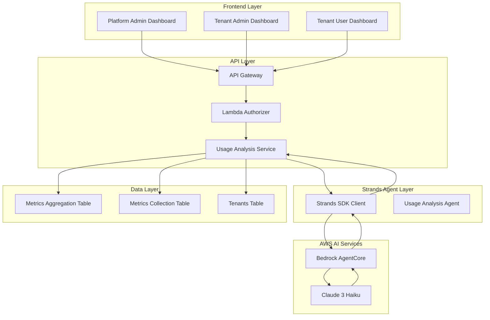
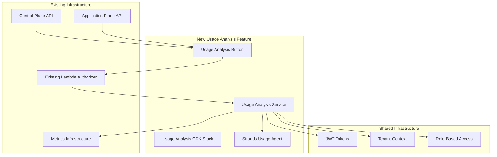

# Design Document

## Overview

The Usage Analysis Agent is a comprehensive analytics service that leverages the existing metering framework to provide detailed usage pattern analysis for the Agentic Insights SaaS platform. The system uses AWS Strands SDK and Bedrock AgentCore to create AI-powered usage insights, serving three distinct user types: SaaS platform admins, tenant admins, and tenant users through role-based analytics.

The design follows the established Strands architecture pattern in the platform, utilizing Strands SDK for agent development, Bedrock AgentCore for deployment, and Lambda functions for API processing. The system integrates seamlessly with the existing metrics collection and aggregation infrastructure while providing both programmatic API access and web-based visualization dashboards.

## Architecture

### High-Level Architecture



### Agent Development Structure

```
src/agents/usage-analysis/
├── agent.yaml                    # Agent configuration
├── tools/
│   ├── tenant_usage_analyzer.py  # Tenant usage analysis tool
│   ├── feature_adoption_analyzer.py # Feature adoption analysis tool
│   ├── performance_analyzer.py   # Performance analysis tool
│   └── ai_usage_analyzer.py      # AI usage analysis tool
├── prompts/
│   └── system_prompt.txt        # Usage analysis expert instructions
├── requirements.txt             # Python dependencies
└── tests/
    └── test_agent.py           # Local testing
```

### Component Integration with Existing System



## Components and Interfaces

### 1. Strands Agent Configuration (agent.yaml)

```yaml
name: usage-analysis-agent
version: 1.0.0
foundation_model: anthropic.claude-3-haiku-20240307-v1:0
description: "AI agent for analyzing usage patterns and providing insights"

tools:
  - name: analyze_tenant_usage
    description: "Analyze comprehensive usage metrics for a specific tenant"
    input_schema:
      type: object
      properties:
        tenant_id:
          type: string
          description: "Tenant ID to analyze (or 'all' for platform admin)"
        date_range:
          type: object
          properties:
            start_date:
              type: string
              description: "Start date (YYYY-MM-DD)"
            end_date:
              type: string
              description: "End date (YYYY-MM-DD)"
        user_role:
          type: string
          enum: ["platform_admin", "tenant_admin", "tenant_user"]
          description: "Role of requesting user for access control"
        user_id:
          type: string
          description: "User ID for tenant_user role filtering"
      required: ["tenant_id", "user_role"]

  - name: analyze_feature_adoption
    description: "Analyze feature adoption patterns and utilization rates"
    input_schema:
      type: object
      properties:
        tenant_id:
          type: string
          description: "Tenant ID to analyze"
        scope:
          type: string
          enum: ["platform", "tenant", "user"]
          description: "Analysis scope based on user role"
        user_role:
          type: string
          enum: ["platform_admin", "tenant_admin", "tenant_user"]
          description: "Role of requesting user for access control"
      required: ["tenant_id", "scope"]

  - name: analyze_performance_metrics
    description: "Analyze performance metrics and identify optimization opportunities"
    input_schema:
      type: object
      properties:
        tenant_id:
          type: string
          description: "Tenant ID to analyze"
        metrics_type:
          type: array
          items:
            type: string
            enum: ["response_time", "error_rate", "throughput", "efficiency"]
      required: ["tenant_id"]

  - name: analyze_ai_usage
    description: "Analyze AI feature usage patterns and cost optimization"
    input_schema:
      type: object
      properties:
        tenant_id:
          type: string
          description: "Tenant ID to analyze"
        include_cost_analysis:
          type: boolean
          description: "Include cost optimization recommendations"
      required: ["tenant_id"]

system_prompt: |
  You are an expert usage analytics consultant for SaaS platforms. Analyze usage patterns, 
  identify trends, and provide actionable insights to help users optimize their platform utilization.
  
  Instructions:
  1. Focus on application plane usage (products, orders, users, AI features)
  2. Provide role-appropriate insights (platform-wide, tenant-specific, or user-specific)
  3. Identify optimization opportunities and best practices
  4. Include trend analysis and growth patterns
  5. Suggest specific actions with estimated impact
  6. Maintain data privacy and tenant isolation
  7. Use clear, non-technical language for recommendations
```

### 2. Usage Analysis Service (Lambda Function)

#### Service Architecture
```python
class UsageAnalysisService:
    def __init__(self):
        self.strands_client = StrandsBedrockClient()
        self.agent_id = os.environ['BEDROCK_AGENT_ID']
        self.agent_alias_id = os.environ['BEDROCK_AGENT_ALIAS_ID']
        self.metrics_table = os.environ['METRICS_AGGREGATION_TABLE_NAME']
        self.tenants_table = os.environ['TENANTS_TABLE_NAME']
    
    def analyze_usage(self, analysis_type, tenant_id, user_role, user_id=None, filters=None):
        # Role-based access control and API plane detection
        # - Control Plane API: platform_admin role (cross-tenant access)
        # - Application Plane API: tenant_admin/tenant_user roles (single tenant)
        # Data filtering and tenant isolation
        # Strands agent invocation with appropriate parameters
        # Response formatting based on user role
        # Usage tracking and audit logging
```

#### Request/Response Flow
```json
// Request
POST /usage-analysis
Headers:
  Authorization: Bearer <jwt_token>
  tenant_id: <tenant_id>
  tier_name: <basic|premium>

Body:
{
  "analysis_type": "tenant_usage",
  "date_range": {
    "start_date": "2025-09-01",
    "end_date": "2025-09-30"
  },
  "filters": {
    "include_ai_usage": true,
    "include_performance": true
  }
}

// Response
{
  "analysis": "Based on your usage patterns over the past month, your team has shown strong adoption of the products feature (95% utilization) and moderate use of AI descriptions (40% utilization). Key insights: 1) Peak usage occurs between 9-11 AM and 2-4 PM, suggesting optimal team productivity windows. 2) AI feature adoption could be increased through training, potentially saving 2-3 hours per week on product descriptions. 3) Order processing efficiency is above average at 85%, indicating good workflow optimization.",
  "data": {
    "tenant_id": "uuid-123",
    "tier": "premium",
    "summary_metrics": {
      "total_api_requests": 1500,
      "feature_adoption_rate": 0.75,
      "average_response_time": 245,
      "ai_usage_count": 45
    }
  },
  "insights": [
    {
      "type": "optimization",
      "category": "feature_adoption",
      "title": "Increase AI Description Usage",
      "impact": "medium",
      "estimated_benefit": {
        "time_savings": "2-3 hours/week",
        "efficiency_gain": 0.15
      }
    }
  ],
  "status": "success"
}
```

### 3. Strands Agent Tools Implementation

#### Tenant Usage Analyzer Tool (tools/tenant_usage_analyzer.py)
```python
import boto3
from datetime import datetime, timedelta
from boto3.dynamodb.conditions import Key

def analyze_tenant_usage(tenant_id: str, date_range: dict, user_role: str) -> dict:
    """
    Analyzes comprehensive usage metrics for a specific tenant
    
    Args:
        tenant_id: Target tenant ID
        date_range: Optional date range for analysis
        user_role: Role of requesting user for access control
    
    Returns:
        Comprehensive usage analysis with role-appropriate data
    """
    
    # Role-based access control
    if user_role == "tenant_user":
        # Limit to user-specific data only (filter by user_id from JWT)
        pass
    elif user_role == "tenant_admin":
        # Full tenant data access (all users within the tenant)
        pass
    
    # Query metrics aggregation table
    dynamodb = boto3.resource('dynamodb')
    metrics_table = dynamodb.Table(os.environ['METRICS_AGGREGATION_TABLE_NAME'])
    
    # Get current month if no date range specified
    if not date_range:
        current_month = datetime.now().strftime('%Y-%m')
        date_range = {"start_date": f"{current_month}-01", "end_date": datetime.now().strftime('%Y-%m-%d')}
    
    # Query tenant metrics
    month = date_range["start_date"][:7]  # Extract YYYY-MM
    response = metrics_table.query(
        IndexName='MonthIndex',
        KeyConditionExpression=Key('month').eq(month),
        FilterExpression=Key('tenant_id').eq(tenant_id)
    )
    
    # Process and aggregate metrics
    usage_data = process_usage_metrics(response['Items'], user_role)
    
    return {
        "tenant_id": tenant_id,
        "analysis_period": date_range,
        "user_role": user_role,
        "usage_summary": usage_data,
        "insights": generate_usage_insights(usage_data, user_role)
    }

def process_usage_metrics(metrics_items: list, user_role: str) -> dict:
    """Process raw metrics into structured usage data"""
    
    api_requests = 0
    lambda_executions = 0
    dynamodb_operations = 0
    ai_requests = 0
    total_cost = 0.0
    
    for item in metrics_items:
        metric_name = item['metric_name']
        total_count = float(item['total_count'])
        estimated_cost = float(item['estimated_cost'])
        
        if 'api_gateway' in metric_name:
            api_requests += total_count
        elif 'lambda' in metric_name:
            lambda_executions += total_count
        elif 'dynamodb' in metric_name:
            dynamodb_operations += total_count
        elif 'bedrock' in metric_name:
            ai_requests += total_count
        
        total_cost += estimated_cost
    
    return {
        "api_requests": int(api_requests),
        "lambda_executions": int(lambda_executions),
        "dynamodb_operations": int(dynamodb_operations),
        "ai_requests": int(ai_requests),
        "total_cost": round(total_cost, 4),
        "feature_breakdown": calculate_feature_usage(metrics_items)
    }

def calculate_feature_usage(metrics_items: list) -> dict:
    """Calculate usage by application feature"""
    
    features = {
        "products": 0,
        "orders": 0,
        "users": 0,
        "ai_descriptions": 0
    }
    
    for item in metrics_items:
        # Infer feature usage from metric patterns
        # This would need to be enhanced based on actual metric naming conventions
        pass
    
    return features
```

#### Feature Adoption Analyzer Tool (tools/feature_adoption_analyzer.py)
```python
def analyze_feature_adoption(tenant_id: str, scope: str) -> dict:
    """
    Analyzes feature adoption patterns and utilization rates
    
    Args:
        tenant_id: Target tenant ID
        scope: Analysis scope (platform, tenant, user)
    
    Returns:
        Feature adoption analysis with recommendations
    """
    
    # Query usage patterns across different features
    adoption_data = query_feature_adoption_data(tenant_id, scope)
    
    # Calculate adoption rates and usage frequency
    adoption_metrics = calculate_adoption_metrics(adoption_data)
    
    # Identify underutilized features
    underutilized = identify_underutilized_features(adoption_metrics)
    
    return {
        "tenant_id": tenant_id,
        "scope": scope,
        "adoption_summary": adoption_metrics,
        "underutilized_features": underutilized,
        "recommendations": generate_adoption_recommendations(adoption_metrics, underutilized)
    }
```

#### Performance Analyzer Tool (tools/performance_analyzer.py)
```python
def analyze_performance_metrics(tenant_id: str, metrics_type: list = None) -> dict:
    """
    Analyzes performance metrics and identifies optimization opportunities
    
    Args:
        tenant_id: Target tenant ID
        metrics_type: Types of metrics to analyze
    
    Returns:
        Performance analysis with optimization recommendations
    """
    
    if not metrics_type:
        metrics_type = ["response_time", "error_rate", "throughput", "efficiency"]
    
    # Query performance-related metrics
    performance_data = query_performance_data(tenant_id, metrics_type)
    
    # Analyze trends and patterns
    performance_analysis = analyze_performance_trends(performance_data)
    
    # Identify optimization opportunities
    optimizations = identify_performance_optimizations(performance_analysis)
    
    return {
        "tenant_id": tenant_id,
        "metrics_analyzed": metrics_type,
        "performance_summary": performance_analysis,
        "optimization_opportunities": optimizations,
        "recommendations": generate_performance_recommendations(optimizations)
    }
```

#### AI Usage Analyzer Tool (tools/ai_usage_analyzer.py)
```python
def analyze_ai_usage(tenant_id: str, include_cost_analysis: bool = True) -> dict:
    """
    Analyzes AI feature usage patterns and cost optimization
    
    Args:
        tenant_id: Target tenant ID
        include_cost_analysis: Include cost optimization recommendations
    
    Returns:
        AI usage analysis with cost optimization insights
    """
    
    # Query AI-specific metrics (Bedrock invocations)
    ai_metrics = query_ai_usage_data(tenant_id)
    
    # Calculate usage patterns and costs
    usage_analysis = calculate_ai_usage_patterns(ai_metrics)
    
    # Cost optimization analysis
    cost_optimizations = []
    if include_cost_analysis:
        cost_optimizations = identify_ai_cost_optimizations(usage_analysis)
    
    return {
        "tenant_id": tenant_id,
        "ai_usage_summary": usage_analysis,
        "cost_analysis": cost_optimizations,
        "recommendations": generate_ai_recommendations(usage_analysis, cost_optimizations)
    }
```

### 4. Infrastructure Components

#### CDK Stack Structure (UsageAnalysisStack)
```typescript
export class UsageAnalysisStack extends Stack {
    constructor(scope: Construct, id: string, props: UsageAnalysisStackProps) {
        super(scope, id, props);
        
        // Import existing resources
        const existingControlApi = RestApi.fromRestApiId(this, 'ExistingControlApi', 
            Fn.importValue('ControlPlaneApiGatewayId'));
        const existingAppApi = RestApi.fromRestApiId(this, 'ExistingAppApi',
            Fn.importValue('AppPlaneApiGatewayId'));
        const existingAuthorizer = Authorizer.fromAuthorizerId(this, 'ExistingAuth',
            Fn.importValue('LambdaAuthorizerId'));
        
        // Usage Analysis Lambda
        const usageAnalysisLambda = new Function(this, 'UsageAnalysisFunction', {
            runtime: Runtime.PYTHON_3_11,
            handler: 'usage_analysis_service.lambda_handler',
            code: Code.fromAsset('src/agents/usage-analysis-api'),
            environment: {
                BEDROCK_AGENT_ID: props.agentId,
                BEDROCK_AGENT_ALIAS_ID: props.agentAliasId,
                METRICS_AGGREGATION_TABLE_NAME: props.metricsAggregationTableName,
                TENANTS_TABLE_NAME: props.tenantsTableName
            },
            timeout: Duration.seconds(60)
        });
        
        // Bedrock and DynamoDB permissions
        usageAnalysisLambda.addToRolePolicy(new PolicyStatement({
            effect: Effect.ALLOW,
            actions: [
                'bedrock:InvokeAgent',
                'bedrock:GetAgent',
                'bedrock:ListAgents'
            ],
            resources: [`arn:aws:bedrock:${this.region}:${this.account}:agent/*`]
        }));
        
        usageAnalysisLambda.addToRolePolicy(new PolicyStatement({
            effect: Effect.ALLOW,
            actions: ['dynamodb:Query', 'dynamodb:GetItem', 'dynamodb:Scan'],
            resources: [
                `arn:aws:dynamodb:${this.region}:${this.account}:table/${props.metricsAggregationTableName}`,
                `arn:aws:dynamodb:${this.region}:${this.account}:table/${props.metricsAggregationTableName}/index/*`,
                `arn:aws:dynamodb:${this.region}:${this.account}:table/${props.tenantsTableName}`
            ]
        }));
        
        // API Gateway integration - Control Plane (for platform admins)
        // Uses admin authentication, provides cross-tenant analytics
        const controlUsageResource = existingControlApi.root.addResource('usage-analysis');
        controlUsageResource.addMethod('GET', new LambdaIntegration(usageAnalysisLambda), {
            authorizer: existingAuthorizer  // Admin authorizer
        });
        controlUsageResource.addMethod('POST', new LambdaIntegration(usageAnalysisLambda), {
            authorizer: existingAuthorizer  // Admin authorizer
        });
        
        // API Gateway integration - Application Plane (for tenant users)
        // Uses tenant authentication with RBAC (tenant_admin/tenant_user)
        const appUsageResource = existingAppApi.root.addResource('usage-analysis');
        appUsageResource.addMethod('GET', new LambdaIntegration(usageAnalysisLambda), {
            authorizer: existingAuthorizer  // Tenant authorizer with RBAC
        });
        appUsageResource.addMethod('POST', new LambdaIntegration(usageAnalysisLambda), {
            authorizer: existingAuthorizer  // Tenant authorizer with RBAC
        });
    }
}
```

### 5. Web Dashboard Components

#### Platform Admin Dashboard (Control Plane)
- **Cross-Tenant Usage Grid**: Aggregated usage comparison across all tenants
- **Platform Growth Trends**: Usage growth patterns and platform-wide metrics  
- **Resource Utilization Heatmap**: Service usage distribution by tier
- **AI-Powered Insights Panel**: Platform optimization recommendations
- **Access**: Uses Control Plane API with admin authentication (separate from tenant RBAC)

#### Tenant Admin Dashboard (Application Plane)
- **Team Usage Overview**: Organization-wide usage metrics and user activity
- **Feature Adoption Analysis**: Team feature utilization and adoption rates
- **Performance Monitoring**: Response times, error rates, and efficiency metrics
- **Usage Optimization Panel**: Team-specific recommendations and best practices
- **Access**: Uses Application Plane API with `tenant_admin` role

#### Tenant User Dashboard (Application Plane)
- **Personal Usage Summary**: Individual activity and feature usage statistics
- **Productivity Timeline**: Personal usage patterns and efficiency trends
- **Feature Discovery**: Recommendations for underutilized features
- **Learning Path**: Personalized suggestions for platform optimization
- **Access**: Uses Application Plane API with `tenant_user` role (filtered to user's own data)

## Data Models

### Usage Analytics Data Model
```typescript
interface UsageAnalyticsData {
  tenant_id: string;
  tier: 'basic' | 'premium';
  date_range: {
    start_date: string;
    end_date: string;
  };
  api_metrics: {
    total_requests: number;
    requests_by_endpoint: Record<string, number>;
    average_response_time: number;
    error_rate: number;
    peak_usage_times: string[];
  };
  feature_metrics: {
    products: {
      created: number;
      updated: number;
      deleted: number;
      most_active_users: string[];
    };
    orders: {
      created: number;
      total_value: number;
      average_order_size: number;
      processing_time: number;
    };
    users: {
      created: number;
      active_users: number;
      login_frequency: number;
    };
    ai_descriptions: {
      generated: number;
      total_tokens: number;
      average_generation_time: number;
      cost: number;
    };
  };
  performance_metrics: {
    response_times: {
      average: number;
      p95: number;
      p99: number;
    };
    error_rates: {
      total_errors: number;
      error_rate: number;
      common_errors: Array<{
        type: string;
        count: number;
        percentage: number;
      }>;
    };
  };
  trends: {
    usage_growth: number;
    feature_adoption_rate: number;
    performance_trend: 'improving' | 'stable' | 'declining';
  };
}
```

### AI Insight Model
```typescript
interface AIInsight {
  type: 'optimization' | 'trend' | 'recommendation' | 'alert';
  category: 'performance' | 'cost' | 'usage' | 'feature_adoption';
  title: string;
  description: string;
  impact: 'high' | 'medium' | 'low';
  confidence: number; // 0-1
  actionable_steps: string[];
  estimated_benefit?: {
    cost_savings?: number;
    performance_improvement?: number;
    efficiency_gain?: number;
  };
  data_points: Array<{
    metric: string;
    current_value: number;
    target_value?: number;
    trend: 'increasing' | 'decreasing' | 'stable';
  }>;
}
```

## Error Handling

### API Error Responses
```typescript
interface ErrorResponse {
  error: {
    code: string;
    message: string;
    details?: Record<string, any>;
  };
  timestamp: string;
  request_id: string;
}
```

### Error Categories
1. **Authentication Errors** (401): Invalid JWT, expired tokens
2. **Authorization Errors** (403): Insufficient permissions, cross-tenant access
3. **Validation Errors** (400): Invalid parameters, malformed requests
4. **Data Errors** (404): Tenant not found, no data available
5. **Service Errors** (500): Bedrock failures, database errors
6. **Rate Limiting** (429): Too many requests, throttling

### Error Handling Strategy
- **Graceful Degradation**: Show cached data when real-time analysis fails
- **Retry Logic**: Exponential backoff for transient failures
- **User-Friendly Messages**: Convert technical errors to actionable guidance
- **Logging**: Comprehensive error logging for debugging and monitoring

## Testing Strategy

### Unit Testing
- **Lambda Functions**: Test individual action group functions
- **Data Processing**: Validate metrics aggregation and filtering logic
- **Role-Based Access**: Verify permission enforcement
- **Error Handling**: Test all error scenarios and edge cases

### Integration Testing
- **API Endpoints**: Test complete request/response cycles
- **Bedrock Agent**: Validate AI analysis quality and consistency
- **Database Queries**: Test performance with large datasets
- **Cross-Service Communication**: Verify metrics pipeline integration

### End-to-End Testing
- **User Workflows**: Test complete user journeys for each role
- **Dashboard Functionality**: Validate web interface interactions
- **Data Accuracy**: Compare analysis results with expected outcomes
- **Performance Testing**: Load testing for concurrent users

### AI Testing
- **Prompt Engineering**: Validate AI response quality and consistency
- **Analysis Accuracy**: Compare AI insights with manual analysis
- **Response Time**: Ensure AI analysis completes within acceptable timeframes
- **Cost Optimization**: Monitor token usage and optimize prompts

## Security Considerations

### Data Protection
- **Tenant Isolation**: Strict enforcement of tenant data boundaries
- **Role-Based Access**: Granular permissions based on user roles
- **Data Encryption**: Encryption in transit and at rest
- **Audit Logging**: Comprehensive access and modification logging

### API Security
- **JWT Validation**: Secure token verification and role extraction
- **CORS Configuration**: Proper cross-origin resource sharing setup
- **Rate Limiting**: Protection against abuse and DoS attacks
- **Input Validation**: Sanitization of all user inputs

### AI Security
- **Prompt Injection Protection**: Sanitization of user-provided analysis parameters
- **Data Sanitization**: Removal of sensitive information from AI prompts
- **Response Filtering**: Validation of AI-generated content
- **Cost Controls**: Monitoring and limits on AI usage costs

## Performance Optimization

### Caching Strategy
- **Response Caching**: Cache frequently requested analysis results
- **Data Aggregation**: Pre-compute common metrics for faster retrieval
- **CDN Integration**: Cache static dashboard assets
- **Session Management**: Optimize Bedrock agent session reuse

### Database Optimization
- **Query Optimization**: Efficient queries using GSI indexes
- **Data Partitioning**: Optimize data access patterns
- **Connection Pooling**: Reuse database connections
- **Batch Processing**: Aggregate multiple operations

### Scalability Considerations
- **Lambda Concurrency**: Configure appropriate concurrency limits
- **Auto Scaling**: Dynamic scaling based on demand
- **Resource Allocation**: Right-size Lambda memory and timeout settings
- **Monitoring**: Comprehensive performance monitoring and alerting

## Deployment Strategy

### Strands Agent Deployment
```bash
# Local development and testing
cd src/agents/usage-analysis/
strands init usage-analysis-agent
strands test --local
strands validate

# Deploy to Bedrock AgentCore
strands deploy --target bedrock --alias prod
```

### CDK Infrastructure Deployment
```bash
# Deploy Usage Analysis feature stack
cd infra/
cdk deploy UsageAnalysisStack \
    --parameters agentId=<agent-id-from-strands> \
    --parameters agentAliasId=<alias-id-from-strands>
```

### Standalone Deployment Script
```bash
#!/bin/bash
# scripts/deploy-usage-analysis-agent.sh

set -e

echo "📊 Deploying Usage Analysis Agent..."

# Step 1: Deploy Strands Agent
echo "📦 Deploying Strands Agent to Bedrock AgentCore..."
cd src/agents/usage-analysis/
AGENT_OUTPUT=$(strands deploy --target bedrock --alias prod --output json)
AGENT_ID=$(echo $AGENT_OUTPUT | jq -r '.agent_id')
ALIAS_ID=$(echo $AGENT_OUTPUT | jq -r '.alias_id')

echo "✅ Agent deployed: $AGENT_ID (alias: $ALIAS_ID)"

# Step 2: Deploy CDK Stack
echo "🏗️ Deploying CDK Infrastructure..."
cd ../../infra/
cdk deploy UsageAnalysisStack \
    --parameters agentId=$AGENT_ID \
    --parameters agentAliasId=$ALIAS_ID \
    --require-approval never

echo "✅ Usage Analysis Agent deployed successfully!"
echo "🔗 Agent ID: $AGENT_ID"
echo "🔗 Control Plane API: /usage-analysis"
echo "🔗 Application Plane API: /usage-analysis"
```

## Monitoring and Observability

### Structured Logging
```python
import structlog

logger = structlog.get_logger()

def log_usage_analysis(tenant_id, analysis_type, user_role, response_time_ms):
    logger.info(
        "usage_analysis_completed",
        tenant_id=tenant_id,
        analysis_type=analysis_type,
        user_role=user_role,
        response_time_ms=response_time_ms,
        agent_id=os.environ['BEDROCK_AGENT_ID']
    )
```

### CloudWatch Metrics
- **Analysis Request Count**: Track usage analysis requests by role and type
- **Response Time**: Monitor AI analysis performance and latency
- **Error Rate**: Track failed analysis requests and error types
- **Cost Tracking**: Monitor Bedrock agent usage costs and token consumption

### Alerting
- **High Error Rate**: Alert when analysis failure rate exceeds 5%
- **Slow Response Time**: Alert when analysis takes longer than 30 seconds
- **Cost Threshold**: Alert when daily AI costs exceed budget thresholds
- **Data Availability**: Alert when metrics data is stale or unavailable