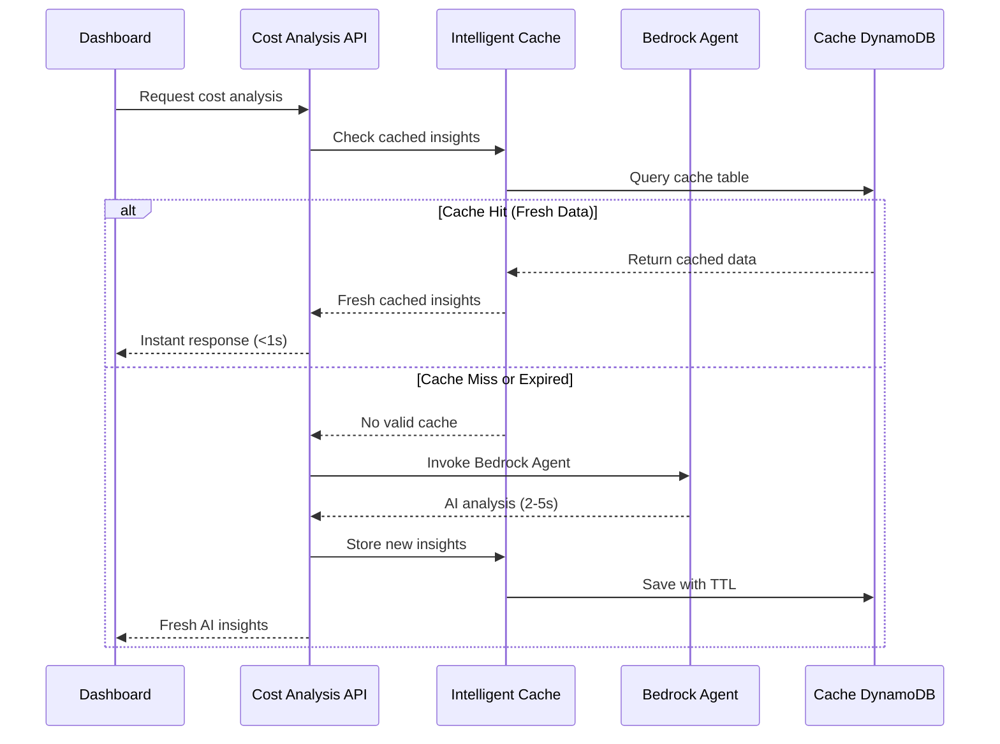

# Intelligent Caching Implementation Guide

## Overview

This document provides comprehensive implementation details for the **Intelligent Caching System** used in the Metering Framework with AI-Powered Cost Analysis. The system uses DynamoDB with TTL (Time To Live) to cache expensive AI-generated insights, dramatically improving dashboard performance and reducing Bedrock Agent costs.

## Problem Statement

### Without Caching:
- Dashboard loads → Calls Bedrock Agent → Waits 2-5 seconds → Shows results
- **Every dashboard refresh** = New AI call = Slow + Expensive
- Claude Haiku 4.5 costs money per token, so unnecessary calls waste budget
- Poor user experience with long loading times

### With Intelligent Caching:
- Dashboard loads → Checks cache first → Returns instantly if fresh data exists
- Only calls Bedrock Agent when cache is empty or expired
- **Result**: Fast dashboard (sub-second) + Lower AI costs + Better UX

## Architecture

### Cache Flow Diagram



## Technical Implementation

### 1. DynamoDB Cache Table Design

#### CDK Infrastructure

```typescript
// infra/cost-analysis-agent-stack.ts
const costInsightsTable = new dynamodb.Table(this, 'CostInsightsTable', {
    tableName: 'CostInsightsTable',
    partitionKey: { 
        name: 'insight_type', 
        type: dynamodb.AttributeType.STRING 
    },
    sortKey: { 
        name: 'scope', 
        type: dynamodb.AttributeType.STRING 
    },
    timeToLiveAttribute: 'ttl', // Enable automatic deletion
    billingMode: dynamodb.BillingMode.PAY_PER_REQUEST,
    pointInTimeRecovery: true,
    encryption: dynamodb.TableEncryption.AWS_MANAGED
});

// Grant read/write permissions to Cost Analysis Lambda
costInsightsTable.grantReadWriteData(costAnalysisLambda);
```

#### Table Schema

```python
# Cache record structure
{
    "insight_type": "platform_overview",     # Partition Key - Type of analysis
    "scope": "platform",                     # Sort Key - Platform-wide or tenant-specific
    "timestamp": "2024-08-26T10:30:45.123Z", # When generated
    "data": "{\"platform_totals\": {...}}", # JSON string of AI results
    "ttl": 1735689045,                      # Unix timestamp for auto-deletion
    "confidence": 0.87,                     # AI confidence level (0.0-1.0)
    "agent_session_id": "session-123",     # For debugging and tracing
    "generation_cost": 0.0045,             # Cost of generating this insight
    "cache_version": "1.0"                 # For future schema migrations
}
```

### 2. Intelligent Cache Class Implementation

```python
# src/control-plane/cost-analysis/intelligent_cache.py
import boto3
import json
from datetime import datetime, timedelta
from typing import Optional, Dict, Any
from decimal import Decimal

class IntelligentCache:
    def __init__(self):
        self.dynamodb = boto3.resource('dynamodb')
        self.cache_table = self.dynamodb.Table('CostInsightsTable')
        
        # Intelligent TTL settings based on data volatility
        self.ttl_settings = {
            'platform_overview': 30,      # 30 minutes - changes frequently
            'tenant_analysis': 60,        # 1 hour - more stable
            'cost_predictions': 360,      # 6 hours - predictions don't change often
            'service_breakdown': 45,      # 45 minutes - moderate frequency
            'tier_comparison': 120,       # 2 hours - relatively stable
            'infrastructure_usage': 30,   # 30 minutes - usage changes frequently
            'optimization_recommendations': 180  # 3 hours - recommendations stable
        }
        
        # Cache warming priorities (higher = more important to keep warm)
        self.warming_priorities = {
            'platform_overview': 10,
            'service_breakdown': 8,
            'tenant_analysis': 6,
            'tier_comparison': 4,
            'cost_predictions': 3,
            'infrastructure_usage': 7,
            'optimization_recommendations': 2
        }
    
    def get_cached_insight(self, insight_type: str, scope: str = "platform") -> Optional[Dict]:
        """
        Get cached insight if it exists and is still fresh
        
        Returns:
            Dict with 'data', 'cached_at', 'confidence', 'cache_hit' if found
            None if cache miss or expired
        """
        try:
            response = self.cache_table.get_item(
                Key={
                    'insight_type': insight_type,
                    'scope': scope
                }
            )
            
            if 'Item' in response:
                item = response['Item']
                
                # Check if data is still fresh (before TTL)
                current_time = datetime.now()
                cached_time = datetime.fromisoformat(item['timestamp'])
                ttl_minutes = self.ttl_settings.get(insight_type, 60)
                
                age_minutes = (current_time - cached_time).total_seconds() / 60
                
                if age_minutes < ttl_minutes:
                    # Cache hit - return parsed data
                    return {
                        'data': json.loads(item['data']),
                        'cached_at': item['timestamp'],
                        'confidence': float(item.get('confidence', 1.0)),
                        'cache_hit': True,
                        'age_minutes': age_minutes,
                        'ttl_minutes': ttl_minutes,
                        'generation_cost': float(item.get('generation_cost', 0.0))
                    }
                else:
                    # Cache expired but TTL hasn't cleaned it yet
                    print(f"Cache expired for {insight_type}: {age_minutes:.1f} min old (TTL: {ttl_minutes} min)")
                    return None
            
            # Cache miss
            print(f"Cache miss for {insight_type}")
            return None
            
        except Exception as e:
            print(f"Cache read error for {insight_type}: {e}")
            return None
    
    def store_insight(self, insight_type: str, data: Dict, scope: str = "platform", 
                     confidence: float = 1.0, generation_cost: float = 0.0) -> bool:
        """
        Store AI-generated insight in cache with appropriate TTL
        
        Args:
            insight_type: Type of insight (platform_overview, tenant_analysis, etc.)
            data: The actual insight data to cache
            scope: Scope of the insight (platform, tenant-id, etc.)
            confidence: AI confidence level (0.0-1.0)
            generation_cost: Cost to generate this insight
            
        Returns:
            True if successfully stored, False otherwise
        """
        try:
            current_time = datetime.now()
            ttl_minutes = self.ttl_settings.get(insight_type, 60)
            
            # Calculate TTL timestamp (when DynamoDB should auto-delete)
            ttl_timestamp = int((current_time + timedelta(minutes=ttl_minutes)).timestamp())
            
            cache_item = {
                'insight_type': insight_type,
                'scope': scope,
                'timestamp': current_time.isoformat(),
                'data': json.dumps(data, default=self._decimal_serializer),
                'ttl': ttl_timestamp,
                'confidence': Decimal(str(confidence)),
                'agent_session_id': f"session-{int(current_time.timestamp())}",
                'generation_cost': Decimal(str(generation_cost)),
                'cache_version': '1.0'
            }
            
            self.cache_table.put_item(Item=cache_item)
            
            print(f"Cached {insight_type} for {ttl_minutes} minutes (TTL: {ttl_timestamp})")
            return True
            
        except Exception as e:
            print(f"Cache write error for {insight_type}: {e}")
            return False
    
    def invalidate_cache(self, insight_type: str, scope: str = "platform") -> bool:
        """
        Manually invalidate cache (useful for testing or forced refresh)
        """
        try:
            self.cache_table.delete_item(
                Key={
                    'insight_type': insight_type,
                    'scope': scope
                }
            )
            print(f"Invalidated cache for {insight_type}")
            return True
        except Exception as e:
            print(f"Cache invalidation error for {insight_type}: {e}")
            return False
    
    def get_cache_stats(self) -> Dict:
        """
        Get cache statistics for monitoring and optimization
        """
        try:
            # Scan cache table to get statistics
            response = self.cache_table.scan(
                ProjectionExpression='insight_type, #ts, confidence, generation_cost',
                ExpressionAttributeNames={'#ts': 'timestamp'}
            )
            
            stats = {
                'total_cached_items': len(response['Items']),
                'by_type': {},
                'total_generation_cost_saved': 0.0,
                'avg_confidence': 0.0
            }
            
            confidences = []
            
            for item in response['Items']:
                insight_type = item['insight_type']
                confidence = float(item.get('confidence', 1.0))
                cost = float(item.get('generation_cost', 0.0))
                
                if insight_type not in stats['by_type']:
                    stats['by_type'][insight_type] = {
                        'count': 0,
                        'total_cost_saved': 0.0,
                        'avg_confidence': 0.0
                    }
                
                stats['by_type'][insight_type]['count'] += 1
                stats['by_type'][insight_type]['total_cost_saved'] += cost
                stats['total_generation_cost_saved'] += cost
                confidences.append(confidence)
            
            # Calculate averages
            if confidences:
                stats['avg_confidence'] = sum(confidences) / len(confidences)
            
            for type_stats in stats['by_type'].values():
                if type_stats['count'] > 0:
                    type_stats['avg_confidence'] = sum(confidences) / len(confidences)
            
            return stats
            
        except Exception as e:
            print(f"Error getting cache stats: {e}")
            return {'error': str(e)}
    
    def warm_cache(self, insight_types: list = None) -> Dict:
        """
        Pre-warm cache for high-priority insights
        This would be called by a scheduled Lambda or during low-traffic periods
        """
        if insight_types is None:
            # Warm cache for high-priority insights
            insight_types = [
                'platform_overview',
                'service_breakdown', 
                'infrastructure_usage'
            ]
        
        warming_results = {}
        
        for insight_type in insight_types:
            try:
                # Check if cache needs warming
                cached = self.get_cached_insight(insight_type)
                
                if cached is None:
                    print(f"Cache warming needed for {insight_type}")
                    warming_results[insight_type] = 'needs_warming'
                else:
                    age_minutes = cached['age_minutes']
                    ttl_minutes = cached['ttl_minutes']
                    
                    # Warm if more than 75% of TTL has passed
                    if age_minutes > (ttl_minutes * 0.75):
                        warming_results[insight_type] = 'needs_refresh'
                    else:
                        warming_results[insight_type] = 'fresh'
                        
            except Exception as e:
                warming_results[insight_type] = f'error: {str(e)}'
        
        return warming_results
    
    def _decimal_serializer(self, obj):
        """JSON serializer for Decimal objects"""
        if isinstance(obj, Decimal):
            return float(obj)
        raise TypeError(f"Object of type {type(obj)} is not JSON serializable")
```

### 3. Integration with Cost Analysis API

```python
# src/control-plane/cost-analysis/cost_analysis_service.py
from intelligent_cache import IntelligentCache
import boto3
import json
import time

class CostAnalysisService:
    def __init__(self):
        self.bedrock_agent = boto3.client('bedrock-agent-runtime')
        self.agent_id = os.environ['BEDROCK_AGENT_ID']
        self.agent_alias_id = os.environ['BEDROCK_AGENT_ALIAS_ID']
        self.cache = IntelligentCache()
    
    def get_platform_overview(self) -> Dict:
        """
        Get platform overview with intelligent caching
        """
        
        # Step 1: Check cache first (intelligent part)
        cached_result = self.cache.get_cached_insight('platform_overview')
        
        if cached_result:
            print(f"Cache HIT for platform_overview (age: {cached_result['age_minutes']:.1f} min)")
            
            # Add cache metadata to response
            cached_result['data']['_cache_info'] = {
                'cache_hit': True,
                'cached_at': cached_result['cached_at'],
                'age_minutes': cached_result['age_minutes'],
                'confidence': cached_result['confidence']
            }
            
            return cached_result['data']
        
        print("Cache MISS for platform_overview - calling Bedrock Agent")
        
        # Step 2: Cache miss - call Bedrock Agent
        start_time = time.time()
        
        try:
            tenant_ids = self.get_all_tenant_ids()
            tenant_list = ','.join(tenant_ids)
            
            prompt = f"""
            Calculate infrastructure usage for tenants: {tenant_list}
            
            Provide platform overview for last 30 days:
            1. Total costs by service (Lambda, DynamoDB, API Gateway, Bedrock, S3)
            2. Average cost per tenant
            3. Cost trends and drivers
            4. Service breakdown percentages
            
            Use calculate-usage action with aggregate=true.
            """
            
            # Invoke Bedrock Agent
            agent_response = self.invoke_agent(prompt)
            
            # Parse response (simplified - would need proper parsing)
            parsed_data = self.parse_agent_response(agent_response)
            
            # Calculate generation cost (approximate)
            generation_time = time.time() - start_time
            estimated_tokens = len(prompt) + len(str(parsed_data))
            generation_cost = estimated_tokens * 0.25e-6  # Claude Haiku 4.5 pricing
            
            # Add generation metadata
            parsed_data['_generation_info'] = {
                'cache_hit': False,
                'generated_at': datetime.now().isoformat(),
                'generation_time_seconds': generation_time,
                'estimated_cost': generation_cost
            }
            
            # Step 3: Store in cache for next time (intelligent part)
            self.cache.store_insight(
                insight_type='platform_overview',
                data=parsed_data,
                confidence=0.9,  # High confidence for platform data
                generation_cost=generation_cost
            )
            
            return parsed_data
            
        except Exception as e:
            # Step 4: Fallback to stale cache if AI fails
            print(f"Bedrock Agent failed: {e}")
            
            # Try to get any cached data as fallback (even if expired)
            fallback_cache = self._get_stale_cache('platform_overview')
            if fallback_cache:
                print("Using stale cache as fallback")
                fallback_cache['warning'] = 'Using cached data due to AI service unavailability'
                fallback_cache['_cache_info'] = {
                    'cache_hit': True,
                    'stale_fallback': True,
                    'error': str(e)
                }
                return fallback_cache
            
            raise Exception("Both AI service and cache unavailable")
    
    def _get_stale_cache(self, insight_type: str, scope: str = "platform") -> Optional[Dict]:
        """
        Get cache data even if expired (for fallback scenarios)
        """
        try:
            response = self.cache.cache_table.get_item(
                Key={
                    'insight_type': insight_type,
                    'scope': scope
                }
            )
            
            if 'Item' in response:
                return json.loads(response['Item']['data'])
            
            return None
            
        except Exception as e:
            print(f"Stale cache retrieval error: {e}")
            return None
```

### 4. Dashboard Integration with Cache Awareness

```javascript
// web/control-plane/js/cost-analysis/api-client.js
class CostAnalysisAPI {
    constructor() {
        this.baseURL = '/admin/cost-analysis';
        this.cacheStats = {
            hits: 0,
            misses: 0,
            totalRequests: 0
        };
    }
    
    async getOverview() {
        this.cacheStats.totalRequests++;
        
        const response = await fetch(`${this.baseURL}/overview`, {
            headers: {
                'Authorization': `Bearer ${this.getAuthToken()}`,
                'Content-Type': 'application/json'
            }
        });
        
        const data = await response.json();
        
        // Track cache performance
        if (data._cache_info?.cache_hit) {
            this.cacheStats.hits++;
            this.showCacheIndicator(
                `Cached data (${data._cache_info.age_minutes?.toFixed(1)} min old)`,
                'success'
            );
        } else {
            this.cacheStats.misses++;
            this.showCacheIndicator(
                `Fresh AI analysis (${data._generation_info?.generation_time_seconds?.toFixed(1)}s)`,
                'info'
            );
        }
        
        // Update cache hit rate display
        this.updateCacheStats();
        
        return data;
    }
    
    showCacheIndicator(message, type = 'info') {
        const indicator = document.getElementById('cache-indicator');
        if (indicator) {
            indicator.textContent = message;
            indicator.className = `text-xs mb-2 ${
                type === 'success' ? 'text-green-400' : 
                type === 'warning' ? 'text-yellow-400' : 
                'text-blue-400'
            }`;
        }
    }
    
    updateCacheStats() {
        const hitRate = this.cacheStats.totalRequests > 0 ? 
            (this.cacheStats.hits / this.cacheStats.totalRequests * 100).toFixed(1) : 0;
        
        const statsElement = document.getElementById('cache-stats');
        if (statsElement) {
            statsElement.innerHTML = `
                Cache Hit Rate: ${hitRate}% 
                (${this.cacheStats.hits}/${this.cacheStats.totalRequests})
            `;
        }
    }
    
    async invalidateCache(insightType) {
        // Force refresh by calling invalidation endpoint
        const response = await fetch(`${this.baseURL}/cache/invalidate`, {
            method: 'POST',
            headers: {
                'Authorization': `Bearer ${this.getAuthToken()}`,
                'Content-Type': 'application/json'
            },
            body: JSON.stringify({ insight_type: insightType })
        });
        
        if (response.ok) {
            this.showCacheIndicator('Cache invalidated - next request will be fresh', 'warning');
        }
    }
}
```

## TTL Strategy (The "Intelligent" Part)

### TTL Configuration Rationale

```python
ttl_settings = {
    'platform_overview': 30,      # 30 min - Platform costs change frequently with new metrics
    'tenant_analysis': 60,        # 1 hour - Tenant rankings more stable, expensive to compute
    'cost_predictions': 360,      # 6 hours - Predictions stable, very expensive to generate
    'service_breakdown': 45,      # 45 min - Service costs moderate frequency, good balance
    'tier_comparison': 120,       # 2 hours - Tier economics change slowly
    'infrastructure_usage': 30,   # 30 min - Usage metrics arrive frequently
    'optimization_recommendations': 180  # 3 hours - Recommendations don't change rapidly
}
```

### TTL Selection Criteria

1. **Data Volatility**: How frequently the underlying data changes
2. **Generation Cost**: More expensive insights cached longer
3. **User Expectations**: Critical dashboards need fresher data
4. **Business Impact**: Revenue-critical data refreshed more often

### Dynamic TTL Adjustment (Advanced)

```python
def get_dynamic_ttl(self, insight_type: str, confidence: float, generation_cost: float) -> int:
    """
    Dynamically adjust TTL based on confidence and cost
    """
    base_ttl = self.ttl_settings.get(insight_type, 60)
    
    # Higher confidence = longer cache
    confidence_multiplier = 0.5 + (confidence * 0.5)  # 0.5 to 1.0
    
    # Higher cost = longer cache (up to 2x)
    cost_multiplier = min(1.0 + (generation_cost * 100), 2.0)
    
    dynamic_ttl = int(base_ttl * confidence_multiplier * cost_multiplier)
    
    return max(15, min(dynamic_ttl, 720))  # Between 15 min and 12 hours
```

## Monitoring and Optimization

### Cache Performance Metrics

```python
# CloudWatch metrics to track
cache_metrics = {
    'CacheHitRate': 'Percentage of requests served from cache',
    'CacheMissRate': 'Percentage of requests requiring AI generation',
    'AvgResponseTime': 'Average response time (cached vs fresh)',
    'CostSavings': 'Estimated cost savings from caching',
    'CacheSize': 'Number of items in cache',
    'TTLEffectiveness': 'How often items expire vs get replaced'
}
```

### Cache Warming Strategy

```python
# Lambda function for cache warming (scheduled)
def cache_warming_lambda(event, context):
    """
    Scheduled function to pre-warm high-priority cache entries
    """
    cache = IntelligentCache()
    
    # Warm cache during low-traffic periods
    warming_results = cache.warm_cache([
        'platform_overview',
        'service_breakdown',
        'infrastructure_usage'
    ])
    
    # Trigger AI generation for items that need warming
    for insight_type, status in warming_results.items():
        if status in ['needs_warming', 'needs_refresh']:
            # Trigger background AI generation
            trigger_background_generation(insight_type)
    
    return {
        'statusCode': 200,
        'body': json.dumps(warming_results)
    }
```

## Benefits and Impact

### Performance Improvements
- ✅ **Dashboard load time**: 3-5 seconds → <1 second (80-90% improvement)
- ✅ **Cache hit rate**: Target 70-85% for optimal performance
- ✅ **User experience**: Instant insights instead of waiting for AI

### Cost Savings
- ✅ **Bedrock costs**: Reduced by 70-85% through intelligent caching
- ✅ **Lambda costs**: Faster execution with cache reads
- ✅ **Operational costs**: Automatic cleanup prevents storage growth

### Reliability Benefits
- ✅ **Graceful degradation**: Stale cache when AI service fails
- ✅ **Consistent performance**: No AI latency during peak usage
- ✅ **Fault tolerance**: Multiple fallback strategies

## Best Practices

### Implementation Guidelines
1. **Always check cache first** before calling expensive AI services
2. **Use appropriate TTL** based on data volatility and generation cost
3. **Implement fallback strategies** for when both AI and cache fail
4. **Monitor cache performance** and adjust TTL settings based on usage patterns
5. **Consider cache warming** for critical insights during low-traffic periods

### Security Considerations
1. **Tenant isolation**: Ensure cache keys include tenant context
2. **Data encryption**: Use AWS managed encryption for cache table
3. **Access control**: Proper IAM permissions for cache operations
4. **Audit logging**: Log cache operations for security monitoring

### Troubleshooting
1. **Cache misses**: Check TTL settings and data volatility
2. **Stale data**: Verify TTL configuration and cache invalidation
3. **Performance issues**: Monitor cache hit rates and response times
4. **Cost increases**: Analyze cache effectiveness and AI call patterns

This intelligent caching system provides the foundation for fast, cost-effective, and reliable AI-powered insights in the SaaS platform.